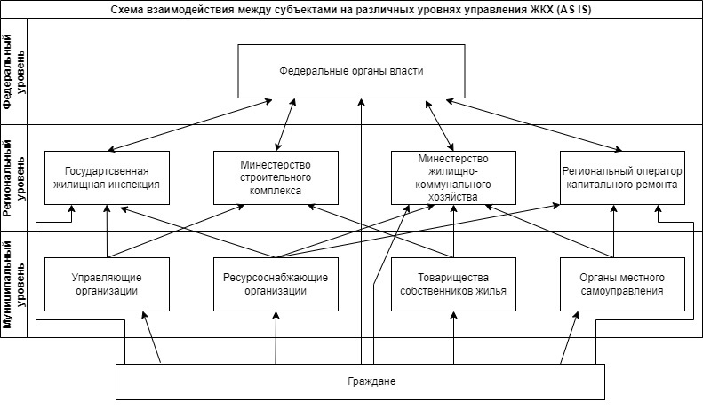

# 2.Позиционирование продукта
## 2.1. Описание бизнес-процесса
Для решения проблем, имеющихся в сфере ЖКХ между гражданами, управляющими компаниями, органами власти нужен процесс упрощения процедуры между ними.  
Создание  цифрового сервиса поможет совершенствованию хозяйственных механизмов системы управления жилищным фондом.

**Продукт "Moe ЖКХ" включает веб-версию для всех пользователей, а также мобильное приложение для жильцов и работников УК.**  

Интеграция с IT-системой органов власти, УК, жильцов и других участников изображенного ниже процесса поможет достичь следующих стратегических бизнес-целей:
- Взаимодействие бизнес-партнеров на базе цифровой платформы ЖКХ, формирование экосистемы ЖКХ на региональном уровне;
- Цифровизация бизнес-процессов ЖКХ всех уровней;
- Рост операционной эффективности процессов планирования, учета и анализа в сфере ЖКХ;
- Повышение качества услуг ЖКХ;
- Рост лояльности граждан к деятельности участников отрасли.  
На данным момент, несмотря на большую заинтересованность на Федеральном уровне власти, нет программного продукта, удовлетворяющего всем критериям и решающего поставленные бизнес-цели.  
На сегодняшний день, схема взаимодействия между субъектами сферы ЖКХ выглядит следующим образом, рис. 2.1.

Рисунок 2.1 - Модель AS IS, взаимодействие между субъектами ЖКХ

## 2.2 Определение проблем
Исходя из представленной выше схемы, можно выделить следующие проблемы:
- Отдельные разрозненые информационные системы у каждого из участников отрасли;
- Отсутсвие полноценной обратной связи на всях уровнях управления.  
Создание цифрового сервиса поможет изменить схему передачи информации между субъектами и решить возникшие проблемы, рис. 2.2.  

Рисунок 2.2 - Модель TO BE, взаимодействие между субъектами ЖКХ

  
  
Изменения в взамодействии между субъектами ЖКХ позволит:
- Повысить эффективность горизонтальных и вертикальных связей между участниками
- Создать открытую архитектуру для взаимодействия
- Интегрировать информационые системы и ИТ-сервисы через API.

## 2.3. Альтернативы (аналоги)    

На данный момент на рынке нет полностью аналогичного продукта, но есть ПО частично выполнящее функционал цифровой систем в "Мой ЖКХ", табл. 2.1. 

Таблица 2.1 – Сравнительная таблица приложений аналогов 

|  **Название   продукта/Критерии для сравнения**    |  **Моё ЖКХ** |     **Домопульт**        | **ДОМ.КОНТРОЛЬ** |  **Домиленд**  | **ГИС ЖКХ** |
|:-------------------------------------------------:|:--------------:|:--------------:|:----------------:|:---------------------:|:----------------:|
| Наличие мобильной версии| да   | да    | да    | да    | нет   |
| Передача   показания приборов учёта | да   | да    | да    | да    | да    |
| Создание   заявок на ремонт в УК и мониторинг статуса их выполнения жильцом  | да    | да    | да     | да   | да    | нет   |
| Возможность оплаты ЖКУ (сумма подгружется автоматически) и платных услуг УК      | да    | да      | да   | да        | да, для ЖКУ   |
| Напоминание об оплате ЖКУ для жильца| да    | да       | да  | нет  | нет  |
| Перенаправление/Назначение заявок диспетчером УК специалисту по ремонту в приложении         | да    | да             | да               | да          | нет  |
| Подтверждение выполнения работ специалистом с фото      | да    | да      | да  | да       | нет  |
| Подтверждение и оценка выполнения работ жильцом   | да    | да     | да   | да   | нет  |
| Рассылка   новостей и уведомлений     | да    | да  | да   | да     | нет  |
| Возможность жильца направить обращение в УК, отличное от заявки на ремонт    | да    | да,   есть чат с диспетчером | нет     | да,   есть возможность создать разные категории обращений | нет  |
| Возможность поставить оценку с отзывом УК      | да    | да   | нет    | нет     | нет     |
| Рейтинг УК          | да    | да      | нет     | нет    | нет     |
| Размещение рекламы сторонних частных лиц и организаций        | нет    | да      | нет     | нет    | нет     |
| Возможность заказа услуг сторонних частных ЛИЦ и организаций помимо УК        | нет    | да      | нет     | нет    | нет     |
| Возможность сотрудников департаментов и министерств/управлений в сфере строительства и ЖКХ, Госжилдазора получать информацию о работе УК на основе данных системы   | да    | нет   | нет | нет | да    |   
| Сотрудники департаментов и министерств/управлений в сфере строительства и ЖКХ, Госжилдазора могут дополнительно получать информацию по капремонтам  | да    | нет  | нет  | нет  | да    |
| Доступ граждан к аналитической информации в сфере ЖКХ | нет    | нет  | нет  | нет  | да    |
| Возможность граждан напрвлять жалобы в органы власти | нет    | нет  | нет  | нет  | да    |

[Домопульт](https://domopult.ru/) - единая среда для решения задач по обслуживанию объектов и оказанию коммунальных услуг жильцам. Включает: Кабинет управляющего (создается на личный кабинет УК на сайте компании, установка не требуется), Онлайн-диспетчерская, Приложение исполнителя, Маркетплейс с платными услугами УК и сторонних организаций (последние 3 в формате мобильных приложений).	

[ДОМ.КОНТРОЛЬ](https://domcontrol.mobi/) - единая бесплатная цифровая система ЖКХ (в рамках нац. проекта "Жильё и городская среда"). Включает: Кабинет управления для руководства УК (сначала создается личный кабинет), CRM-систему для сотрудников УО (добавляются сотрудники в автоматизированную диспетчерскую), Мобильное приложение для жителей, Мобильное приложение для мастеров.
				
[Домиленд](https://domyland.ru/) - платформа для автоматизации УК позволяет сократить расходы на управление многоквартирным домом, повысить качество сервиса и получать дополнительную прибыль. Включает: приложение жителя и веб-приложение и мобильное приложение для сотрудников. Можно добавить персональный дизайн и логотип, функционал взаимодействия жителей и маркетплейс для размещения своих платный услуг и сторонних компаний, а также доп. функционал для повышения лояльности клиентов, например, для управления паркингом, дистанционного открытия шлагбаума и домофона и доступа к видеокамерам.

[ГИС ЖКХ](https://my.dom.gosuslugi.ru/) - веб-приложение, интегрированное с Госуслугами, позволяющее гражданам передавать показания приборов учета, оплачивать ЖКУ, получать широкий спектр практической и общей аналитической информации в сфере ЖКХ, направлять жалобы в органы власти, знакомиться с новостями, нормативными документами в сфере ЖКХ.

## 2.4. Определение позиции продукта на рынке 

- Для региональных и местных органов власти, которые хотят повысить эффективность управления жилищным фондом и удовлетворённость населения качеством жизни и сферой ЖКХ, в частности в рамках проекта "Умный город", **"Mоё ЖКХ"** является инструментом снижения собственных затрат и контроля за эффективностью работы частных организаций в сфере ЖКХ.

- В отличие от выше указанных аналогов наш продукт дает возможность прямого доступа сотрудников органов власти к необходимой для этого информации. 