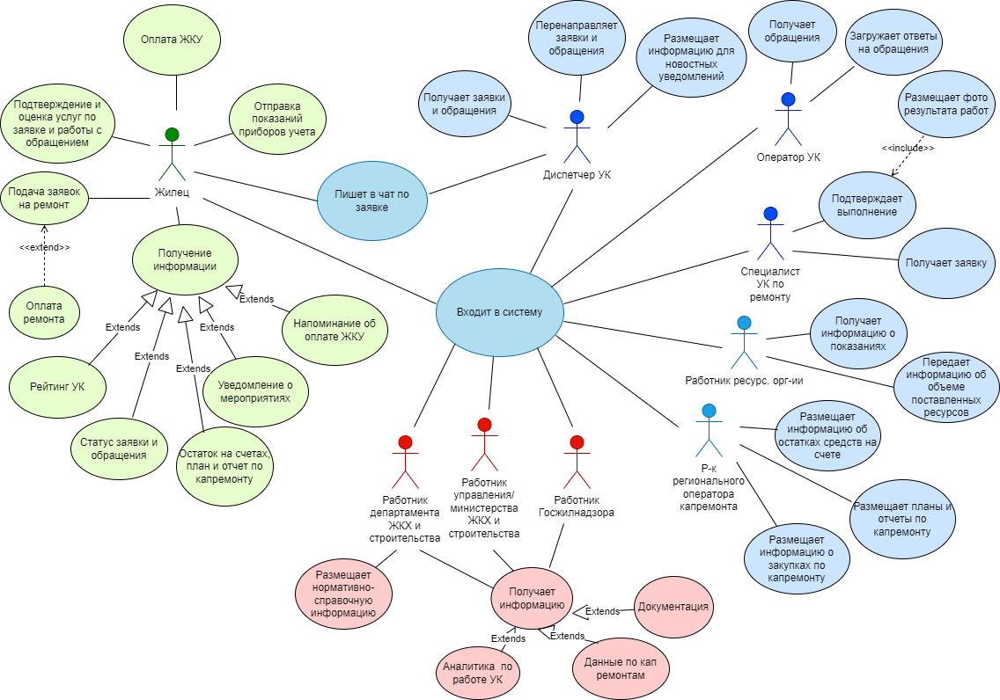

# 4.Описание продукта
## **4.1 Предлагаемое решение**

С точки зрения информационных блоков для пользователей в системе продукт имеет следующие подсистемы:

Рисунок 4.1 - Состав подсистем цифровой платформы "Мое ЖКХ"

С точки зрения функциональных возможностей продукта программа имеет модули в зависимости от групп пользователей, проиллюстрированные ниже:
- Модуль УК - пользователи - все работники УК,
- Модуль Ресурсосберегающие организации - пользователи - работники УК,
- Модуль Жилец - пользователи - жильцы,
- Модуль Органы власти в ЖКХ - пользователи - работник органов власти из раздела Пользователи,
- Модуль Региональный оператор капремонта - пользователи - работники Регионального оператора капремонта.

Рисунок 4.2 - Диаграмма вариантов использования

  

В основе создания цифрового сервиса "Мое ЖКХ" лежит цифровая платформа, которая представляет собой интегрированное рабочее пространство для всех участников отрасли ЖКХ, а ее использование позволит сделать их взаимодействие быстрым и эффективным. 

## **4.2	Предположения и зависимости**

Можно выделить следующие основные ограничения ИТ-проекта "Мое ЖКХ", включающие в себя сроки проекта, трудозатраты и бюджет.

**Факторы, которые могут повлиять на функции, указанные в проекте:**
- бюджет проекта;
- сроки реализации проекта;
- сбор и анализ требований заинтересованных сторон;
- изменение границ проекта.  
**Допущения:**
- работники УК имеют мобильное устройство с операционной системой Android/ IOS;
- для приема оплат организации имеют онлайн-кассу;
- пользователи веб-версии обладают офисными приложениями для сохранения информации в виде, необходимом для загрузки в систему.  
**Ограничения:**
- наличие в УК продуктов пересекающихся с функционалом нашего продукта в части взаимодействия с жильцом;
- наличие технической возможности хранения данных;
- необходимость защиты персональных данных и коммерческой информации пользователей.  
**Зависимости:**
- проект зависит от интересов сторон с сильным влиянием, возможен конфликт их интересов с пользователями.  

## **4.3 Затраты, каналы продвижения**
Любое предприятие или субъект сферы ЖКХ с помощью автоматизации стремится повысить эффективность своей деятельности. Для этого и было задумано создание цифровой платформы "Мое ЖКХ".  
Ориентировочный срок создания проекта - 1 год (365 дней). Для реализации проекта будут использованы различные
виды материальных и трудовых ресурсов, представленные в табл. 4.1.  

Таблица 4.1 - Расчет затрат на создание цифровой системы «Мое ЖКХ»
|**Тип затрат**|**Описание**|**Сумма затрат в мес, руб.**|**Итоговая сумма затрат по проекту, руб.**|**Комментарии**|
|:-:|:-:|:-:|:-:|:-:|
|**Затраты на ФОТ**|На реализацию проекта потребуется минимум команда из 5 чел|5 чел * 120 000 руб. = 600 000 руб.|720 000 руб.|Средняя зарплата сотрудников 120 000 руб., учитывается с НДФЛ и ЕСН.|
|**Расходы на ИТ-сервисы**|АСУ ФКР, модуль EAM, 1С:Документооборот, Qlik Sense  (лицензия)|472 000 руб.|5 664 000 руб.|Приобретение лицензий, предоставление доступа|
|**Аренда серверов**|Предоставление вычислительных мощностей |118 455,71 руб|1 421 468,52 руб.|Сервер БД – 47 202,32 руб., сервер BackEnd – 31 112,93 руб., сервер FrontEnd – 17 828,46 руб., Сервер Qlick Sense – 22 312 руб.|
|**Эксплуатация оборудования**|Норматив затрат на амортизацию оборудования|5 * 500 руб. = 2 500 руб.|30 000 руб.|1 ед. оборудования на сотрудника, участвующего в проекте|
|**Прочие расходы**|Дополнительные расходы, возникающие в процессе реализации проекта|59 647,76 руб.|715 773,42 руб.|Составляют 5% от суммы общих затрат|

Итоговая сумма расходов на разработку проекта составит **8 551 241,94 руб**.  

Помимо расходов на создание проекта, также расчитаем сумму затрат на сопровождение проекта в год, табл. 4.2  

Таблица 4.2 - Сумма затрат на сопровождение цифровой системы «Мое ЖКХ»
|**Тип затрат**|**Описание**|**Сумма затрат в мес, руб.**|**Итоговая сумма затрат по проекту, руб.**|**Комментарии**|
|:-:|:-:|:-:|:-:|:-:|
|**Затраты на ФОТ**|На сопровождение цифровой системы потребуется команда минимум из 2 чел|2 чел * 132 000 руб. = 264 000 руб.|264 000 руб.|Средняя зарплата сотрудников с индексацией, учитывается с НДФЛ и ЕСН.|
|**Расходы на ИТ-сервисы**|АСУ ФКР, модуль EAM, 1С:Документооборот, Qlik Sense  (лицензия)|472 000 руб.|5 664 000 руб.|Приобретение лицензий, предоставление доступа|
|**Аренда серверов**|Предоставление вычислительных мощностей |118 455,71 руб|1 421 468,52 руб.|Сервер БД – 47 202,32 руб., сервер BackEnd – 31 112,93 руб., сервер FrontEnd – 17 828,46 руб., Сервер Qlick Sense – 22 312 руб.|
|**Эксплуатация оборудования**|Норматив затрат на амортизацию оборудования|2 * 500 руб. = 1 000 руб.|12 000 руб.|1 ед. оборудования на сотрудника, сопровождающего проект|
|**Прочие расходы**|Дополнительные расходы, возникающие в процессе реализации проекта|42 772,79 руб.|513 273,43 руб.|Составляют 5% от суммы общих затрат|  

Итоговая сумма затрат на сопровождение продукта составит **7 874 741,95 руб**.

Экономический эффект от внедрения ИТ-решения может
быть лишь косвенным, так как внедренное решение не
является прямым источником дохода, а является либо
вспомогательным средством организации получения прибыли,
либо помогает минимизировать затраты.

## **4.4	Функциональные возможности**

Функциональные требования предъявляемые к продукту, в разбивке по модулям, описаны в табл. 4.3.

Таблица 4.3 - Функциональные требования к цифровой системе «Мое ЖКХ»

|**ID функционального требования**|**Требование**|**Связанные требования**|**Приоритет**|
|:-:|:-:|:-:|:-:|
|***Модуль "УК"***|
|1.1 Регистрация в системе| Нужна форма для регистрации в системе || Высокий|
|1.2 Авторизация в системе| Нужна форма для авторизации в системе|  Возможность регистрации в системе | Высокий |
|1.3 Размещение информации для уведомлений|УК имеет возможность размещать информацию доступную для граждан|Граждане должны получать уведомления о новых новостях|Низкий|
|1.4 Получение и обработка заявок от граждан|Сотрудники УК должны получать уведомления о поступлении новой заявки|Граждане могут из личного кабинета направлять обращения в УК|Высокий|
|1.5 Выставление счета  по услугам УК|Выставление счета  по услугам УК для МКД|Граждане должны получать уведомления о выставленных счетах|Высокий|
|***Модуль  "Ресурсоснабжающие организации"*** |  
|2.1.Регистрация в системе| Нужна форма для регистрации в системе || Высокий|
|2.2.Авторизация в системе| Нужна форма для авторизации в системе| Возможность регистрации в системе | Высокий |
|2.3 Выставление счета об объеме поставленных ресурсов|Выставление счета за объемы потребленных ресурсов гражданами|Граждане должны получать уведомления о выставленных счетах|Высокий|
|2.4 Размещение информации об остатках средств на счетах граждан|Сотрудники региональных ресурсоснабжающих организаций отражают остаток на балансе граждан|В личном кабинете граждан отражается сумма остатка на счете за уплату ЖКУ|Средний|
|***Модуль "Жилец"*** |
|3.1 Регистрация в системе| Нужна форма для регистрации в системе || Высокий|
|3.2 Авторизация в системе| Нужна форма для авторизации в системе| Возможность регистрации в системе | Высокий |
|3.3 Подача заявок на ремонт|Граждане должны через специализированную форму оставлять заявки на ремонт|Заявка должна отражаться у УК |Высокий|
|3.4 Отправка показаний приборов учета |Граждане имеют возможность оставить показания счетчиков в личном кабинете|Данные должны передаваться в ресурсоснабжающие организации |Высокий|
|3.5 Статус заявки и обращения |В личном кабинете жильца должен отображаться статус обращения|УК имеет возможность менять статус заявки от граждан |Низкий|
|3.6 Оплата ЖКУ | В личном кабинете должна быть возможность оплаты услуг ЖКУ| Поступление информации о платеже в ресурсоснабжающие организации |Высокий|
|3.7 Напоминание об оплате за услуги ЖКУ |Через определенный интервал времени должно поступать уведомление об оплате ЖКУ| Проверка баланса счета граждан в УК и ресурсоснабжающих организациях|Низкий|
|3.8 Уведомления о мероприятиях || ||
|3.9 Рейтинг УК |Граждане могут выставлять оценку и комментарии по работе УК| Граждане могут видеть рейтинг всех УК региона|Низкий|
|***Модуль "Органы власти в ЖКХ"*** |
|4.1.Регистрация в системе| Нужна форма для регистрации в системе ||| Высокий|
|4.2.Авторизация в системе| Нужна форма для авторизации в системе| Возможность регистрации в системе || Высокий |  
|4.3 Размещение нормативно-справочной информации |Сотрудники ФО ЖКХ должны иметь возможность к уже существующей базе, добавлять новую нормативно-справочную информацию|Сотруднику ресурсоснабжающих организаций, УК и граждане могут настроить параметры  уведомлений о получении новой нормативно-справочной информации ||
|4.4 Получение данных по кап.ремонту |На основе проведенных работ региональным органом по кап.ремонту | Региональный оператор кап.ремонта должен иметь возможность обновлять в базе информацию по кап.ремонту ||
|4.5 Получение аналитических данных по работе УК | На основе информации о количестве ремонтов, сроках оказания услуг, оценки жильцам работы УК | Связан с функционалом модулей УК и Жилец |Низкий|
|4.6 Получение информации по конкретным заявкам в УК | На основе заявки, комментариев к ней, отчета о работе специалиста УК и отзыве жильца по конкретной заявке | Связан с функционалом модулей УК и Жилец |Высокий|
|***Модуль "Региональный оператор капремонта"*** |  
|5.1.Регистрация в системе| Нужна форма для регистрации в системе || Высокий|
|5.2.Авторизация в системе| Нужна форма для авторизации в системе| Возможность регистрации в системе || Высокий |
|5.3 Размещает информацию об о средствах на счете/в фонде | Нужна возможность загрузить информацию о средствах на счете в систему | Жильцы  и органы власти имеют функционал для получения информации |Высокий|
|5.4 Размещение информации об закупках по капремонту | Добавить функционал для загрузки документов по закупке и описания в систему| В личном кабинете граждан отражается сумма остатка на счете за уплату ЖКУ |Низкий|
|5.5 Размещение планов и отчетов по кап.ремонту | База о датах запланированных кап.ремонтов МКД|Жильцы имеют функционал для получения информации|Низкий|