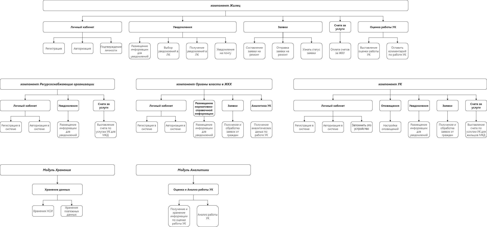

# 1. ОПРЕДЕЛЕНИЕ СТРУКТУРЫ ЗАДАЧ ПРОЕКТА  

В проекте разработки цифрового продукта "Мое ЖКХ", можно выделить 6 основных инициатив, соответсвующие компонентам и модулям системы - (компонент "УК", компонент "Органы власти в ЖКХ", компонент "Ресурсоснабжающие организации", компонент "Жилец", модуль хранения, Модуль аналитики), которые в свою очередь подразделены на ряд эпиков и задач (Рис. 1).

  

Рисунок 1 – Структура задач Agile-проекта по разроботке цифрового продукта "Мое ЖКХ"
