# 1. ОПИСАНИЕ ПОЛЬЗОВАТЕЛЬСКИХ ИНТЕРФЕЙСОВ
### С макетом прототипа можно ознакомится по ссылке  
[Макет системы "Мое ЖКХ"](https://www.figma.com/proto/BrjowG06KlcsqjmuYKyoCe/%D0%9C%D0%BE%D1%91-%D0%96%D0%9A%D0%A5?page-id=13%3A3&node-id=44%3A200&viewport=81%2C686%2C0.06&scaling=scale-down&starting-point-node-id=44%3A200&show-proto-sidebar=1) 

## Экранная форма "2-0-1 ЛК Жилец"

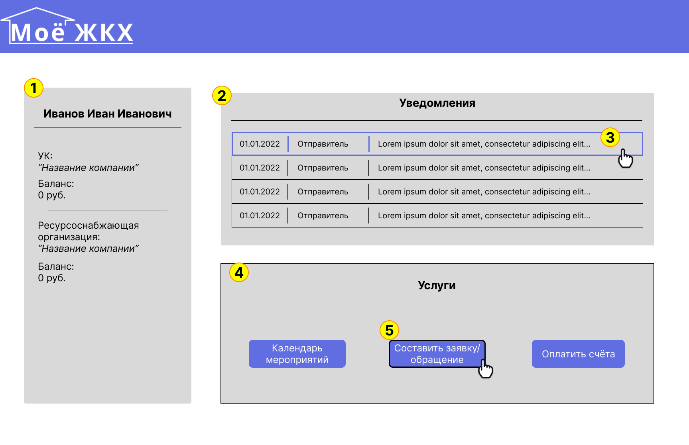

| № п/п | Наименование элемента | Тип элемента | Назначение элемента | Описание, комментарии, ограничения |
|----|----|----|----|----|
| 1 | Блок личной информации пользователя (Жильца) | Информационный блок | Отображает общую информацию для жильца | Информация: имя жильца, перечень связанных с ним УК и ресурсоснабжающих компаний и баланс жильца у каждой организации |
| 2 | Блок превью уведомлений от органов ЖКХ | Список уведомлений | Предоставить список уведомлений от органов ЖКХ | На превью отображается: Дата, отправитель, и тема уведомления |
| 3 | Открыть уведомление | Уведомление | Открыть полностью выбранное уведомление, для ознакомления с ним целиком | По нажатию всплывает экранная форма "2-0-2 ЛК Жилец" |
| 4 | Блок с перечнем услуг | Информационный блок | Отображает список предоставляемых услуг | Услуги представлены в виде кнопок, которые ведут к соответсвующим разделам |
| 5 | Кнопка услуги | Кнопка | Переход в раздел конкретной услуги | По нажатию осущетсвляется перехд на соответсвующую экранную форму |

## Экранная форма "2-0-2 Раскрытое уведомление"
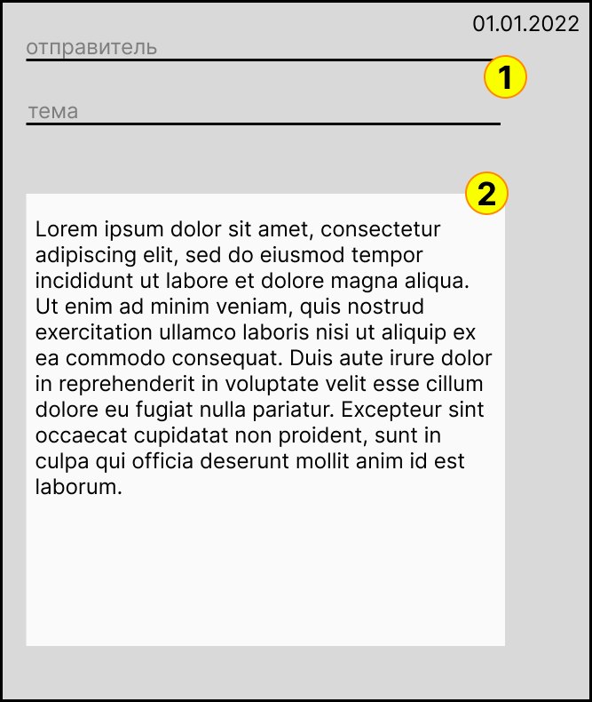

| № п/п | Наименование элемента | Тип элемента | Назначение элемента | Описание, комментарии, ограничения |
|----|----|----|----|----|
| 1 | Дата/Отправитель/Тема Уведомления | Информация |  Отображает Дату/Отправителя/Тему выбранного уведомления |  |
| 2 | Текст уведомления | Информация | Отображает Текст выбранного уведомления |  |

## Экранная форма "2-1-1 календарь событий"
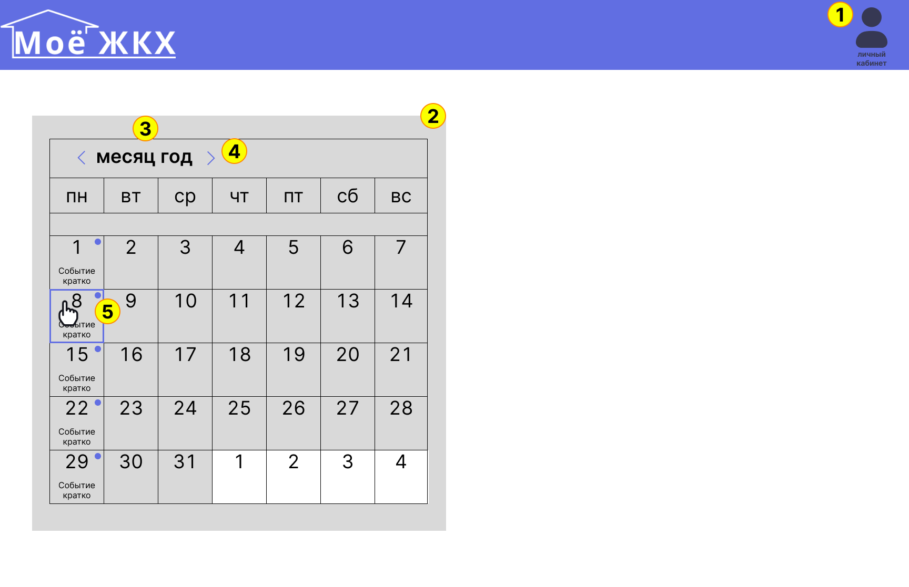

| № п/п | Наименование элемента | Тип элемента | Назначение элемента | Описание, комментарии, ограничения |
|----|----|----|----|----|
| 1 | Кнопка личного кабинета | Кнопка | Осуществляет переход пользователя в личный кабинет | По нажатию всплывает экранная форма "2-0-1 ЛК Жилец" |
| 2 | Блок календаря | Информационный блок | Отображает календарь событий на конкретный месяц |  |
| 3 | Месяц/год | Информация | Отображает выбранный месяц, события которого указаны в календаре |  |
| 4 | Кнопка переключения месяцев | Кнопка | Отображает в календаре следующий месяц | По нажатию в календаре появляется следующий месяц с новыми текущими событиями |
| 5 | Индикатор события | Информация | Отображает наличие запланированного события в конкретный день | Индикация дня с событием происходит синим кругом в углу и подписью с названием мероприятия под датой|
| 6 | Кнопка раскрытия события | Кнопка | При нажатиии на дату с событием всплывает окно с описанием события в выбранный день | Описание событий - экранная форма 2-1-2 |

## Экранная форма "2-1-2 раскрытое событие"
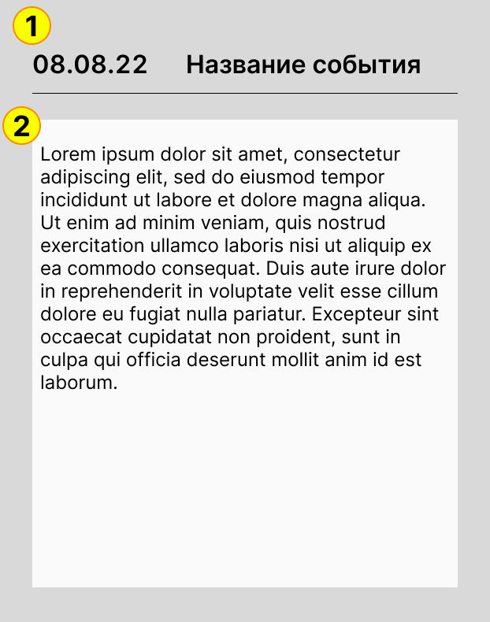

| № п/п | Наименование элемента | Тип элемента | Назначение элемента | Описание, комментарии, ограничения |
|----|----|----|----|----|
| 1 | Дата/Название события | Информация |  Отображает Дату/Название выбранного события |  |
| 2 | Описание события | Информация | Отображает описание выбранного уведомления |  |

## Экранная форма "2-2-1 обращения"
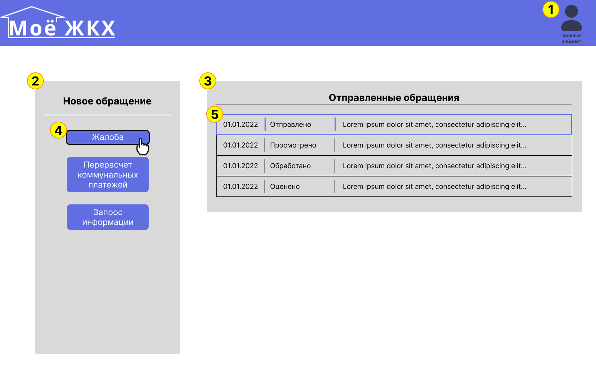

| № п/п | Наименование элемента | Тип элемента | Назначение элемента | Описание, комментарии, ограничения |
|----|----|----|----|----|
| 1 | Кнопка личного кабинета | Кнопка | Осуществляет переход пользователя в личный кабинет | По нажатию всплывает экранная форма "2-0-1 ЛК Жилец" |
| 2 | Блок с типов обращений | Информационный блок | Отображает список типов обращений | Типы обращений представлены в виде кнопок, которые ведут к соответсвующим разделам (с разными шаблонами обращений) |
| 3 | Блок превью отправленных обращений | Список отправленых обращений | Предоставить список отправленых обращений от жильца  органам ЖКХ | На превью отображается: Дата, статус обращения, и тема обращения |
| 4 | Кнопка услуги | Кнопка | Переход в раздел конкретной услуги | По нажатию осущетсвляется перехд на соответсвующую экранную форму |
| 5 | Открыть обращение | Обращение | Открыть выбранное Обращение, для ознакомления с его статусом и ответом на него | По нажатию всплывает экранная форма "2-2-2 Открытое обращение" |

## Экранная форма "2-2-2 Открытое обращение"
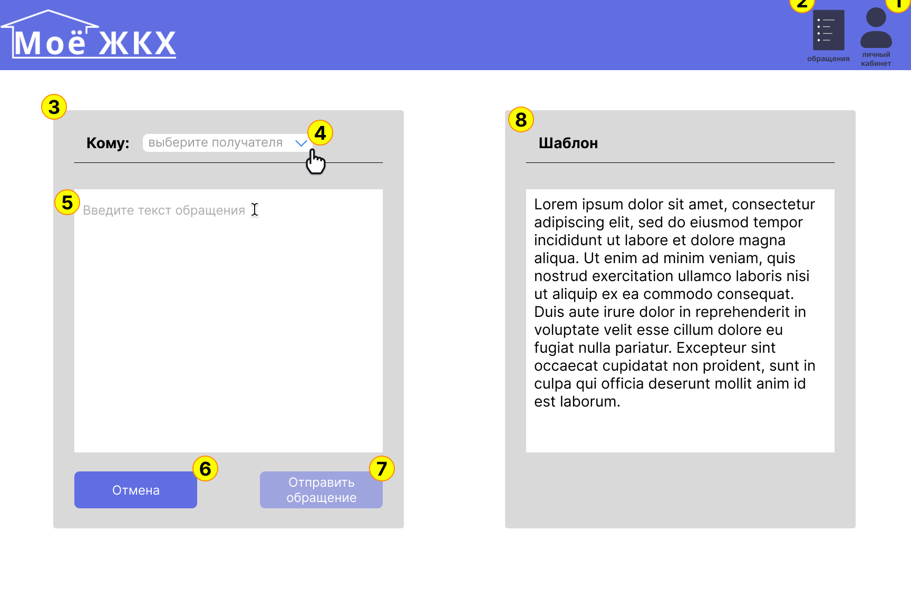

| № п/п | Наименование элемента | Тип элемента | Назначение элемента | Описание, комментарии, ограничения |
|----|----|----|----|----|
| 1 | Кнопка личного кабинета | Кнопка | Осуществляет переход пользователя в личный кабинет | По нажатию всплывает экранная форма "2-0-1 ЛК Жилец" |
| 2 | Кнопка главного экрана обращений | Кнопка | Осуществляет переход пользователя на главный экран раздела "Обращения" | По нажатию всплывает экранная форма "2-2-1 обращения" |
| 3 | Блок составления обращения | Блок ввода | Отображает форму для составления обращения |  |
| 4 | Кнопка выбора адресата | Кнопка | Предоставляет возможность выбора адресата | По нажатию появляется выпадающий список (экранная форма 2-2-3) с адресатами (УК и РСО, с которыми связан пользователь) |
| 5 | Поле для ввода текста обращения | Поле ввода | Ввести текст обращения для отправки в органы ЖКХ | Для некоторых типов обращения может содержать шаблон для заполнения |
| 6 | Кнопка отмены | Кнопка | Позволяет удалить обращение | По нажатию составляемое обращение удаляется и пользователь возвращается на экранную форму 2-2-1 |
| 7 | Кнопка отправки сообщения | Кнопка | Позволяет отправить сообщение адресату  | По нажатию обращение отправляется адресату и пользователь возвращается на экранную форму 2-2-1; Кнопка активна только после выбора адресата и заполнения поля ввода обращения|

## Экранная форма "2-2-3 Раскрытое уведомление"
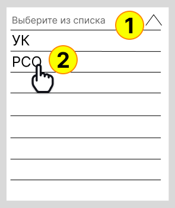

| № п/п | Наименование элемента | Тип элемента | Назначение элемента | Описание, комментарии, ограничения |
|----|----|----|----|----|
| 1 | Блок с адресатами | Информационный блок | Отображает возможных адресатов для отправки обращения |  |
| 2 | Адресат | Кнопка |  При нажатии на выбранного адресата, он добавляется в поле "кому" в форме 2-2-2 |  |

## Экранная форма "2-2-4 Отправленные обращения"
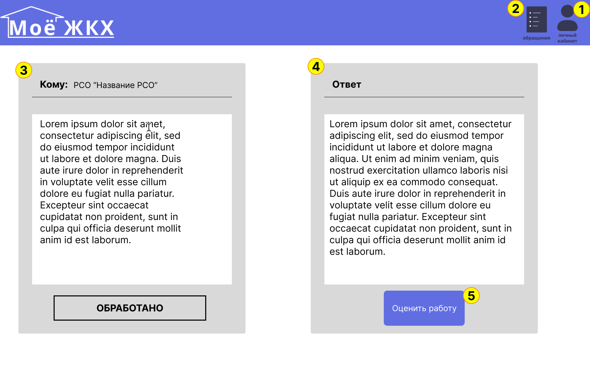

| № п/п | Наименование элемента | Тип элемента | Назначение элемента | Описание, комментарии, ограничения |
|----|----|----|----|----|
| 1 | Кнопка личного кабинета | Кнопка | Осуществляет переход пользователя в личный кабинет | По нажатию всплывает экранная форма "2-0-1 ЛК Жилец" |
| 2 | Кнопка главного экрана обращений | Кнопка | Осуществляет переход пользователя на главный экран раздела "Обращения" | По нажатию всплывает экранная форма "2-2-1 обращения" |
| 3 | Блок отправленного обращения | Информационный блок | Отображает текст обращения и его статус | Возможные статусы: "Отправлено", "Принято в работу", "Обработано" |
| 4 | Блок ответа на обращение | Информационный блок | Отображает ответ на обращение | В процессе обработки обращения (Статусы "Отправлено", "Принято в работу") текст ответа - "В процессе подготовки..." |
| 5 | Кнопка оценки работы органа ЖКХ | Кнопка | Осущетсвляет переход в раздел оценки работы | По нажатию производится переход в экранную фору 2-2-5|

## Экранная форма "2-2-5 Оценка работы"
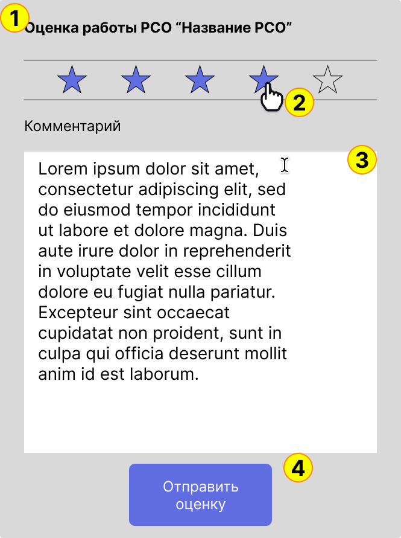

| № п/п | Наименование элемента | Тип элемента | Назначение элемента | Описание, комментарии, ограничения |
|----|----|----|----|----|
| 1 | Название организации | Информация |  Отображает название оцениваемой организации |  |
| 2 | Кнопка выбора оценки | Кнопка | Осуществляет выставление оценки | Оценка ранжируется от 1 до 5 (в форме звездочек) |
| 3 | Поле для ввода коментария к оценке | Поле ввода | Ввести текст коментария к оценке работы организации по заявке |  |
| 4 | Кнопка отправки оценки | Кнопка | Позволяет отправить оценку | Кнопка становится активной только после проставления оценки и заполнения коментария. |

## Экранная форма "2-3-1 Счета"
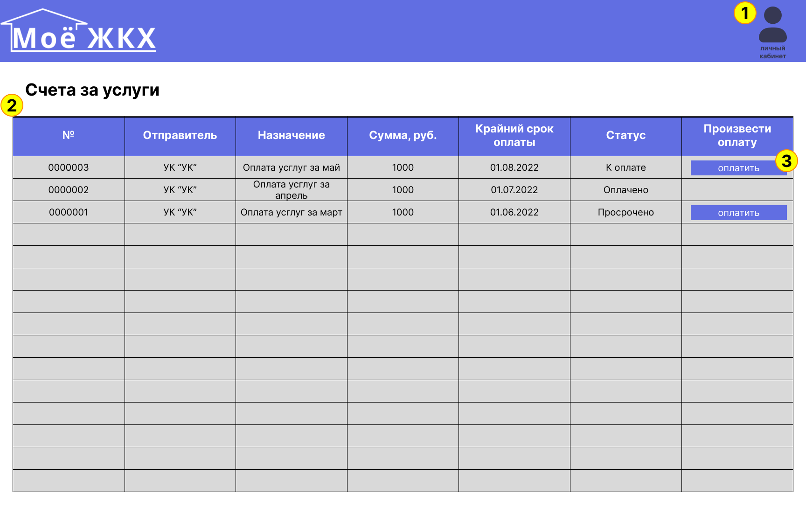

| № п/п | Наименование элемента | Тип элемента | Назначение элемента | Описание, комментарии, ограничения |
|----|----|----|----|----|
| 1 | Кнопка личного кабинета | Кнопка | Осуществляет переход пользователя в личный кабинет | По нажатию всплывает экранная форма "2-0-1 ЛК Жилец" |
| 2 | Таблица с информацией о счетах | Информационный блок | Отображает информацию по полученным счетам | Информация: id счета; составитель счета; Назначение счета; Сумма к оплате; Срок оплаты, после которого последуют санкции; Статус оплаты |
| 3 | Кнопка оплатить | Кнопка | При нажатии осущетсвляется переход во внешний платежный сервис для произведения оплаты |  |

## 3.1	"ЛК УК - Начальный экран"

| № п/п | Наименование элемента | Тип элемента | Назначение элемента | Описание, комментарии, ограничения |
|----|----|----|----|----|
| 1 | Логотип, пользователь, название организации, иконка ЛК, иконка уведомлений | Шапка страницы | отображение логотипа, пользователя, названия организации, иконки ЛК, иконки уведомлений со счетчиком | При нажатии на иконки ЛК и уведомлений появляются выпадающме меню (см. п/п 1.1, 1.1.2, 1.2)  |
| 1.1 |  | Выпадающее меню | форма для входа в систему под учетной записью пользователя | Содержит формы ввода Логина и Пароля; при неверно введенных логине или пароле у поля ввода меняется атрибут "цвет" параметра "Stroke" с #000000 на FF0000, после начала нового ввода параметр меняется в исходное значение |
| 1.1.2 | | Выпадающее меню | Содержит форму с: 1) указателем должности и ФИО пользователя авторизованного в системе, 2) Кнопки - "Личные данные" (Для перехода на страницу управления данными пользотваеля) | "Выход" (Кнока выхода из системы, после нажатия закрывается данное меню и открывается выпадающее меню см. гл.3.1 п/п 1.1) |
| 1.2 |  | Выпадающее меню | Содержит список групп уведомлений с указанием количества непрочитанных и кнопку перехода ко всем уведомлениям см. гл.3.3 "ЛК-УК-Уведомления |  |
| 2 | Заявки, обращения граждан, счета на оплату | Кнопка | Служит для перехода на соответсвующую форму | - |
| 3 | Новости компании, Новости ЖКХ | Фрэйм | Размещение новостей компании для сотрудников, размещение новостей в сфере ЖКХ | Так же свободное пространство может быть использовано для размещения "Виджетов с других форм", рекламной информации для сотрудников и др. |

## 3.2	"ЛК УК - Заявки от граждан"

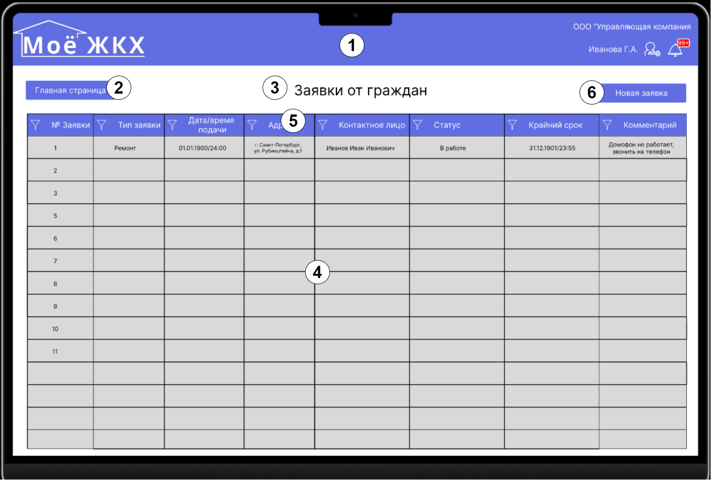

| № п/п | Наименование элемента | Тип элемента | Назначение элемента | Описание, комментарии, ограничения |
|----|----|----|----|----|
| 1 | Логотип, пользователь, название организации, иконка ЛК, иконка уведомлений | Шапка страницы | см. гл. 3.1, п/п 1 | см. гл. 3.1, п/п 1 |
| 2 | Главная страница | Кнопка | Служит для перехода на начальную страницу |  |
| 3 | Заявки граждан | Текст | Отображение названия формы |  |
| 4 | Таблица | Фрэйм | Отображение заявок поступающих в систему в виде сводной таблицы | В строчках расположенны заявки граждан; нумерация выставляется автоматически по порядку поступления заявок; Столбцы разделяют информацию о заявками по ее свойствам и типам данных: Заявки, Тип заявки, Дата/время подачи, Адрес, Контактное лицо, Статус, Крайний срок, Комментарий; При нажатии левой кнопки мышки по строчке осуществляется переход на форму "Содержание заявки" см. гл.3.3; |
| 5 | Загаловки столбцов таблицы п/п 4 | Загаловки таблицы | Отображение названия столбцов, фильтры данных по столбцам | При нажатии на значек фильтра открывается всплывающие меню с параметрами фильтра, пример см. гл.3.2 п/п 5.1; при нажатии на название заголовка происходит сортировка по возрастанию/убыванию данных столбца (Текст: А-Я, A-Z/Я-А, Z-A; Цыфры: 0-N/N-0, Дата: от ранней к поздей/от поздней к ранней), по умолчанию сортировка по возрастанию |
| 5.1 |    | Всплывающее меню | Примеры всплывающего меню: Фильтр в столбце "Тип заявки" выбор значения(ий) из списка; Фильтр в столбце "Дата/время подачи" выбор даты/диапазона дат | Формы и функцианал всех фильтров еще не согласован со стейкхолдерами и будет предствален в последующих спринтах |
| 6 | Новая заявка | Кнопка | Переход на пустую форму "Содержание заявки" для создания заявки | Номер и дата поступления генерируются и заполняются автоматиечески |

## 3.3.	"ЛК УК - Содержание заявки"

| № п/п | Наименование элемента | Тип элемента | Назначение элемента | Описание, комментарии, ограничения |
|----|----|----|----|----|
| 1 | Логотип, пользователь, название организации, иконка ЛК, иконка уведомлений | Шапка страницы | см. гл. 3.1, п/п 1 | см. гл. 3.1, п/п 1 |
| 2 | Главная страница | Кнопка | Служит для перехода на "Начальную страницу" | При изменениях содержания полей в форме "Содержание заявки" выдать всплывающую форму "Сохранить изменения?", пример: 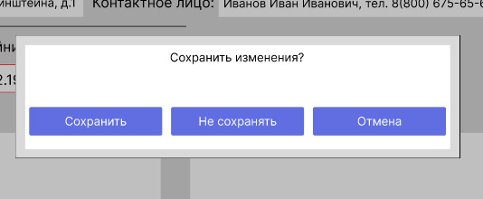, действия кнопок на форме "Сохранить изменеия?": Сохранить - Сохранить изменения форме "Содержание заявки" и перейти на страницу "ЛК УК - Начальный экран"; Не сохранять - перейти на страницу "ЛК УК - Начальный экран" без сохранения изменений в форме "Содержание заявки" и; Отмена - закрыть всплывающую форму "Сохранить изменения?" и остаться на странице "ЛК УК - Содержание заявки" для дальнейшего редактирования |
| 3 | К заявкам | Кнопка | Переход на страницу "Заявки от граждан"  | пример см. гл.3.3, п/п 2, действия кнопок на форме "Сохранить изменеия?": Сохранить - Сохранить изменения форме "Содержание заявки" и перейти на страницу "ЛК УК - заявки от гржадан"; Не сохранять - перейти на страницу "ЛК УК - заявки от гржадан" без сохранения изменений в форме "Содержание заявки" и; Отмена - закрыть всплывающую форму "Сохранить изменения?" и остаться на странице "ЛК УК - Содержание заявки" для дальнейшего редактирования |
| 4 | Заявка № n от Дата/время | Текстовая метка | Отображение Номера заявки и даты/времени ее поступления | Заполняется автоматически при поступлении от граждан через систему/создании заявки диспетчером/оператором |
| 5 | Адрес:  | Поле отображения адреса | Отображение адреса по которому поступила заявка | Заполняется 1) автоматически при подаче заявки жильцом через "ЛК-Жильца" 2) Вводится вручную диспетчером/оператором при поступлении заявки по телефону или личном обращении граждан |
| 6 | Статус: "В работе" | Форма вывода информации из выпадающего списка | при нажатии выпадает список | Пример списка: , обязательно поле, при отсутсвии значения в поле меняется атрибут "цвет" параметра "Stroke" с #000000 на FF0000, после выбора параметр меняется в исходное значение #000000 |
| 7 | Крайний срок: "дата/время" | Форма вывода даты и времени из всплывающего календаря | при нажатии всплывает календать | В календаре нужно выбрать дату и время, Пример календаря: , обязательно поле, при отсутсвии значения в поле меняется атрибут "цвет" параметра "Stroke" с #000000 на FF0000, после выбора параметр меняется в исходное значение #000000 |
| 8 | Описание заявки: "Текст заявки от жильца" | Форма ввода текста | Служит для отображения или ввода текста заявки | Ввод осуществляется жильцом при добавлении заявки через "ЛК-Жильца" или диспетчером при поступлении заявки по тел. или личном обращении жильца |
| 9 | Комментарий: "Комментарий" | Форма ввода текста | Служит для отображения или ввода текста комментария | Ввод осуществляется жильцом при добавлении заявки через "ЛК-Жильца" и/или диспетчером для внутренних комментариев ЖКХ при поступлении заявки по тел. или личном обращении жильца |
| 10 | Отмена | Кнопка | Остаться на странице "ЛК УК - Содержание заявки" для дальнейшего редактирования |  |
| 11 | Сохранить | Кнопка |  Сохранить - Сохранить изменения форме "Содержание заявки" и перейти на страницу "ЛК УК - заявки от гржадан" | |

## 4.1	"ЛК РСО - Начальный экран"

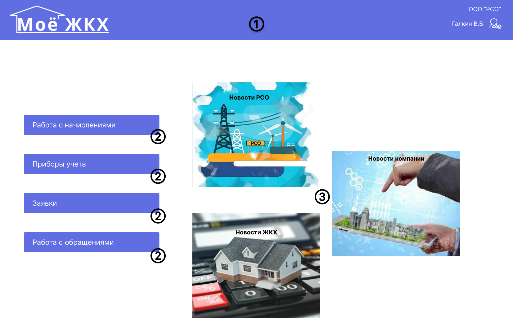

| № п/п | Наименование элемента | Тип элемента | Назначение элемента | Описание, комментарии, ограничения |
|----|----|----|----|----|
| 1 | Логотип, пользователь, название организации, иконка ЛК, иконка уведомлений | Шапка страницы | отображение логотипа, пользователя, названия организации, иконки ЛК | При нажатии на иконки ЛК появляются выпадающме меню |
| 2 | Работа с начислениями, приборы учета, заявки, работа с обращениями | Кнопка | Служит для перехода на соответсвующую форму | - |
| 3 | Новости РСО, Новости компании, Новости ЖКХ | Фрэйм | Размещение новостей компании для сотрудников, размещение новостей в сфере РСО, ЖКХ | Так же свободное пространство может быть использовано для размещения "Виджетов с других форм", рекламной информации для сотрудников и др. | |

## 4.2	"ЛК РСО - Работа с начислениями"

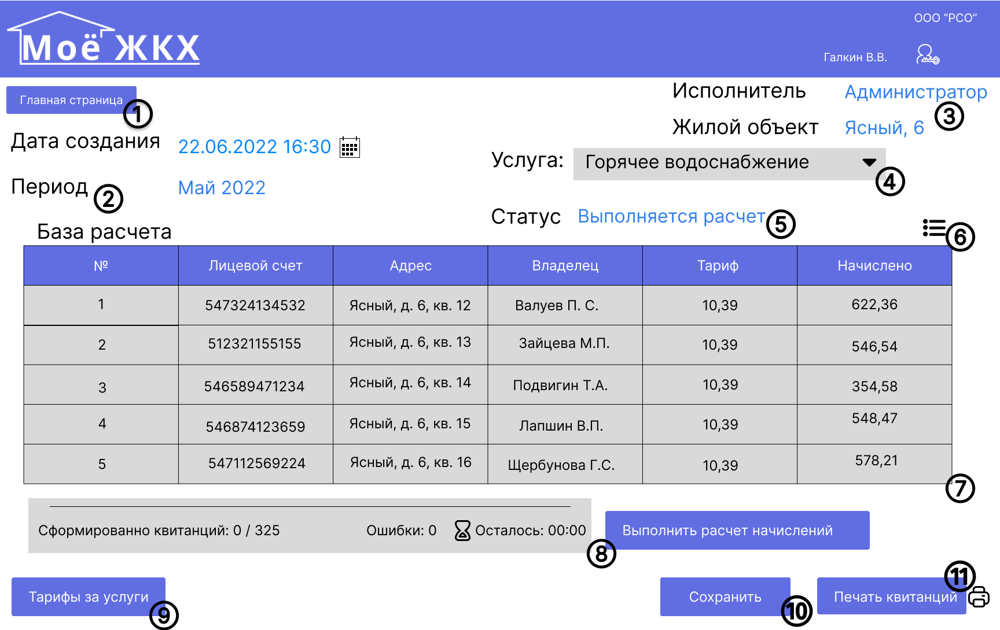

| № п/п | Наименование элемента | Тип элемента | Назначение элемента | Описание, комментарии, ограничения |
|----|----|----|----|----|
| 1 | Главная страница | Кнопка | Служит для перехода на начальную страницу |  |
| 2 | Дата создания, период | Форма вывода даты и времени создания из всплывающего календаря и период | Отображение даты создания расчета и интересующего периода расчета | Для изменения периода расчета установите курсор в поле период и выберите интересующий нас |
| 3 | Исполнитель, жилой объект | Поле отображения исполнителя, жилого объекта | Отображение исполнителя, в зависимости от наделения полномочий, адреса жилого объекта, по которому производится начисления | При нажатии появляются выпадающий список исполнителей и адреса |
| 4 | Услуга | Поле вывода услуги | Поле служит для вывода услуг РСО | При нажатии появляются выпадающий список интересующих услуг |
| 5 | Статус | Форма вывода информации из выпадающего списка | Поле отображения статуса расчета | В зависимости от статуса меняется значение: Подготовлен, выполняется расчет, сформирован, подтвержден |
| 6 | Фильтр таблицы | Кнопка | По нажатию происходит открытие окна с типами фильтрации и возможностью отмены | Выберите один из следующих типов фильтров: Общие фильтры: фильтрация по определенным значениям или диапазону значений; Фильтр по выбору: фильтрация всех строк таблицы, содержащих значение, которое соответствует выбранному значению в строке, путем фильтрации представления таблицы; Фильтрация по форме: фильтрация по нескольким полям в форме или таблице либо поиск определенной записи; Расширенный фильтр: Чтобы отфильтровать тип, в котором задаются настраиваемые условия фильтра |
| 7 | Таблица | Фрэйм | Отображение базы расчета в виде сводной таблицы | Можно отсортировать по возрастанию или убыванию лицевой счет, квартиру. Информация о начислении и тарифе |
| 8 | Выполнить расчет начислений | Кнопка | Служит для выполнения расчета | Виден процес колличеста успешно сформированных квитанций, квитанции упавшие в ошибки, расчет времени формирования. В случае ошибки формируется повторно  |
| 9 | Тарифы за услуги | Кнопка | Служит для отображения актуальной информации по тарифам | Загружается в виде сводной таблицы |
| 10 | Сохранить | Кнопка |  Сохранить - Сохранить изменения форме "Работа с начислениями" |
| 11 | Печать квитанций | Кнопка |  Для печати платежного документа нажмите на кнопку «Печать» | Система отображает на странице печатную форму платежного документа |

## 4.3.	"ЛК РСО - Приборы учета"

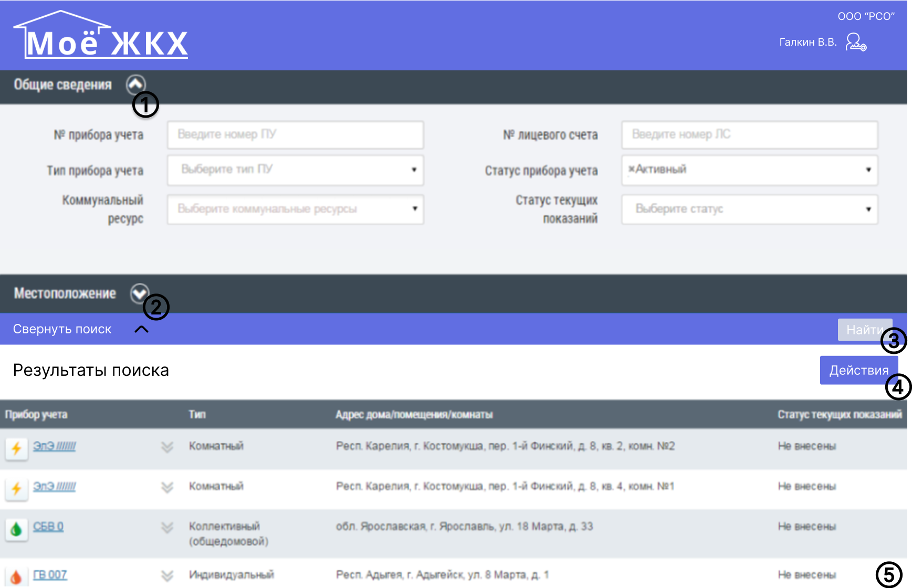

| № п/п | Наименование элемента | Тип элемента | Назначение элемента | Описание, комментарии, ограничения |
|----|----|----|----|----|
| 1 | Общие сведения | Всплывающее меню | Служит для отображения параметров поиска. По умолчанию содержимое раздела не отображается | Для заполнения полей «№ прибора учета», «№ лицевого счета», «Статус текущих показаний» необходимо ввести корректные значения в поля. Для заполнения полей «Тип прибора учета», «Коммунальный ресурс», «Статус прибора учета» выберите значения из выпадающего списка |
| 2 | Местоположение | Всплывающее меню | Служит для отображения параметров поиска. По умолчанию содержимое раздела не отображается | При необходимости задания параметров поиска в разделе «Местоположение» нажмите на наименование раздела для отображения его содержимого и задайте параметры поиска. Для заполнения полей в данном разделе необходимо выбрать значение из выпадающего списка. Поля заполняются последовательно, начиная с поля «Субъект РФ». |
| 3 | Найти | Кнопка | В блоке «Результаты поиска» отображается информация, соответствующая заданным параметрам  |  |
| 4 | Действия | Кнопка | Отображение добавления и корректировки списка ПУ | Для создания ПУ нажмите на кнопку «Действие» на странице «Реестр приборов учета» и выберите пункт «Добавить ПУ»  |
| 5 | Таблица  | Фрэйм | Отображение результата поиска | Информация о приборах учета включает: обозначение прибора учета; тип прибора; адрес дома/помещения/комнаты; статус текущих показаний | |