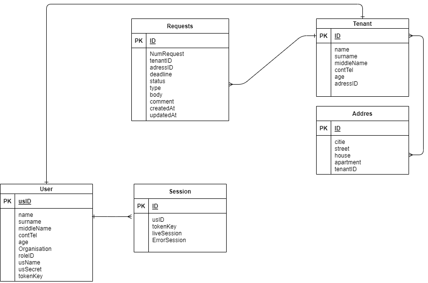

# REST API

## 1 ЛК-УК

Клиенты REST API:
- Мобильное приложение
- Web-интерфейс администратора
- Сторонняя система АИС "1С"

Роли:
- Пользователь (Жилец);
- Оператор (Диспетчер);
- Администратор (Администратор АИС).
- Анонимный пользователь
Права: 
- пользователь (Создание заявки, запрос заданной заявки)
- оператор (Создание заявки, запрос списка заявок, запрос заданной заявки, полное редактирование заявки, частичное редактирование заявки)
- администратор (Создание заявки, запрос списка заявок, запрос заданной заявки, полное редактирование заявки, удаление заявок)
- Анонимный пользователь (Не имеет прав)

URI: https://MyZKH.ru/ManagementCompany/api/



### 1.0 Авторизация пользователя

Запрос от пользователя:

`POST /session/`

{
    "usID": "iopweru34-woerjpwoeri-jop234890wfio",
    "usName" "R25pdmNTcHJpbnQzR3JvdXAxMQ==",
    "usSecret""T3VyUHJvdG90eXBlVHVybmVkT3V0V2VsbCxEaWRuJ3RJdD8="
}

Ответ: 

```json
{
    "sessionID": "asfsagjnl-sdfkljnas;ldkf-2rnkflnds",
    "liveSession": "12345647",
    "tokenKey": "langnSfjSF*qwrmpLAS<0Wd4",
        {"usID": "iopweru34-woerjpwoeri-jop234890wfio",
        "name": "Галина",
        "surname": "Иванова",
        "middleName": "Алексеевна",
        "contTel": "8(952) 352-15-25",
        "age": "56",
        "Organisation": "ООО Управляющая компания",
        "roleID": "Оператор"
        },
    
}
```
### 1.1 Получение списка заявок

Запрос от администратора:

`GET /Request`

Ответ:

```json
[
  {"id": "asd484w-er16a5sd-6a5s",
  "NumRequest": "1",
  "tenant": {
    "ID": "afadf4w-erhjrysd-345s",
    "name": "Иван",
    "surname": "Иванов",
    "middleName": "Иванович",
    "contTel": "8(800) 675-65-65"
  },
  "addres": {
    "ID": "23thj4w-egty56j4-3rth",
    "citie": "Санкт-Петербург",
    "street": "Рубинштейна",
    "house": "1",
    "apartment": "100",
  },
  "type": "В работе",
  "Body": "Протекает труба ввода холодной воды, просьба устранить",
  "deadline": "1991-31-12T23:55:00Z",
  "comment": "Срочная заявка, взять с собой сварочный аппара",
  "createdAt": "1900-01-01T00:00:00Z",
  "updatedAt": "1937-01-02T09:30:52Z"
  }

  {"id": "ID Заявки",
  "NumRequest": "номер заявки по базе",
  "tenant": {
    "ID": "ID Жильца",
    "name": "Имя жильца",
    "surname": "Фамилия жильца",
    "middleName": "Отчество"
  },
  "addres": {
    "ID": "ID адреса",
    "citie": "Город",
    "street": "Название улицы",
    "house": "№ дома",
    "apartment": "№ квартры",
  },
  "type": "Тип заявки",
  "Body": "Текст сообщения заявки отжильца",
  "deadline": "yyyy-MM-ddT00:00:00Z",
  "comment": "Комментарий к заявке",
  "createdAt": "yyyy-MM-ddT00:00:00Z",
  "updatedAt": "yyyy-MM-ddT00:00:00Z"
  }

]
```

Запрос доступен для ролей: пользователь, оператор, администратор.

### 1.2 Редактирование комментария в заданной заявке

Запрос от оператора:

`PATCH /Request/asd484w-er16a5sd-6a5s`

{
  "comment": "Срочная заявка, взять с собой сварочный аппара, при уточнении по телефону у жильца выяснилось, что не работает домофон, звонить по контактному номеру 8(800) 675-65-65"
}

Ответ:

```json

  {
    "id": "asd484w-er16a5sd-6a5s",
  "NumRequest": "1",
  "tenant": {
    "ID": "afadf4w-erhjrysd-345s",
    "name": "Иван",
    "surname": "Иванов",
    "middleName": "Иванович"
  },
  "addres": {
    "ID": "23thj4w-egty56j4-3rth",
    "citie": "Санкт-Петербург",
    "street": "Рубинштейна",
    "house": "1",
    "apartment": "100"
  },
  "type": "В работе",
  "Body": "Протекает труба ввода холодной воды, просьба устранить",
  "deadline": "1991-31-12T23:55:00Z",
  "comment": "Срочная заявка, взять с собой сварочный аппара, при уточнении по телефону у жильца выяснилось, что не работает домофон, звонить по контактному номеру 8(800) 675-65-65",
  "createdAt": "1900-01-01T00:00:00Z",
  "updatedAt": "1937-01-02T09:30:52Z"
  }
  ```

Запрос доступен для ролей: оператор, администратор.

### 1.3 Удаление заданной

Запрос от Администратора:

`DELATE /Request/farefq43t-345344-fgh56u`
  
Запрос доступен для ролей: администратор.

## 2 ЛК-Жилиц
## Клиенты REST API

Клиенты REST API:
- Web-интерфейс пользователя
- Web-интерфейс админитсратора

## Роли

- Зарегистрированный пользователь;
- Администратор.

## Запросы и ответы

### Получение информации об организациях предоставляющих услуги клиенту по его идентификатору

`GET /residents/:residentId/companies`

Пример ответа:
```json
[
  {
  "id": "4d9bc1e2-21dd-4adc-8cdf-57ce0b098114",
  "type": "УК",
  "name":"Ромашка",
  "balance": "-500.36",
  "createdAt": "1937-06-01T11:40:00Z",
  "updatedAt": "1937-06-01T11:40:00Z"
  },
  {
    ...
  }

]

```

 Запрос доступен для ролей: зарегистрированный пользователь администратор.
___
 ### Получение всех уведомления для пользователя по его идентификатору

`GET /notifications/:residentId`

Пример ответа:
```json
[
  {
  "id": "95w5se85-s9vl-kn8p-rdiy-9npkz4cf8eij",
  "fromCompanyId": "3hqi-ym1p-y1q8-ri3z",
  "toResidentId": "4n6i-09a5-c51v-5m4n",
  "theme": "Lorem ipsum",
  "body": "Lorem ipsum dolor sit amet, consectetur adipiscing elit, sed do eiusmod tempor incididunt ut labore et dolore magna aliqua.",
  "sendAt": "2022-06-02",
  "createdAt": "2022-06-01T11:40:00Z",
  "updatedAt": "2022-06-01T11:40:00Z"
  },
  {
    ...
  }

]

```

 Запрос доступен для ролей: зарегистрированный пользователь администратор.
 ___
 ### Получение всех события для пользователя по его идентификатору

`GET /events/:residentId`

Пример ответа:
```json
[
  {
  "id": "95w5se85-s9vl-kn8p-rdiy-9npkz4cf8eij",
  "residentId": "4n6i-09a5-c51v-5m4n",
  "eventName": "Крайний срок оплаты счета для УК",
  "eventDate": "2022-07-01",
  "decription": "Lorem ipsum dolor sit amet, consectetur adipiscing elit, sed do eiusmod tempor incididunt ut labore et dolore magna aliqua.",
  "createdAt": "2022-06-01T11:40:00Z",
  "updatedAt": "2022-06-01T11:40:00Z"
  },
  {
    ...
  }

]

```

 Запрос доступен для ролей: зарегистрированный пользователь администратор.

  ___
 ### Полученить шаблон обращения по его идентификатору

`GET /templates/:id`

Пример ответа:
```json

{
"id": "95w5se85-s9vl-kn8p-rdiy-9npkz4cf8eij",
"templateName": "Перерасчет платежа",
"body": "Lorem ipsum dolor <sit amet>, consectetur adipiscing elit, <sed do eiusmod tempor> incididunt ut labore et dolore magna aliqua.",
"createdAt": "2022-06-01T11:40:00Z",
"updatedAt": "2022-06-01T11:40:00Z"
}

```

 Запрос доступен для ролей: зарегистрированный пользователь администратор.

 ___
 ### Получение всех обращений пользователя по его идентификатору

`GET /requests/:residentId`

Пример ответа:
```json
[
  {
  "id": "95w5se85-s9vl-kn8p-rdiy-9npkz4cf8eij",
  "toCompanyId": "4n6i-09a5-c51v-5m4n",
  "theme": "Замена лампочек в подъезде",
  "body": "Lorem ipsum dolor sit amet, consectetur adipiscing elit, sed do eiusmod tempor incididunt ut labore et dolore magna aliqua.",
  "createdAt": "2022-06-01T11:40:00Z",
  "updatedAt": "2022-06-01T11:40:00Z"
  },
  {
    ...
  }

]

```

 Запрос доступен для ролей: зарегистрированный пользователь администратор.

  ___
 ### Создать обращение

`POST /requests`

Пример запроса:
```json

{
"toCompanyId": "4n6i-09a5-c51v-5m4n",
"theme": "Замена лампочек в подъезде",
"body": "Lorem ipsum dolor sit amet, consectetur adipiscing elit, sed do eiusmod tempor incididunt ut labore et dolore magna aliqua."
}

```

Пример ответа:
```json

{
"id": "95w5se85-s9vl-kn8p-rdiy-9npkz4cf8eij",
"fromResidentID": "3hqi-ym1p-y1q8-ri3z",
"toCompanyId": "4n6i-09a5-c51v-5m4n",
"theme": "Замена лампочек в подъезде",
"body": "Lorem ipsum dolor sit amet, consectetur adipiscing elit, sed do eiusmod tempor incididunt ut labore et dolore magna aliqua.",
"createdAt": "2022-06-01T11:40:00Z",
"updatedAt": "2022-06-01T11:40:00Z"
}
```

Запрос доступен для ролей: зарегистрированный пользователь администратор.
___
### Полученить ответ на обращение по его идентификатору

`GET /responds/:requestId`

Пример ответа:
```json

{
"id": "95w5se85-s9vl-kn8p-rdiy-9npkz4cf8eij",
"requestId": "4d9bc1e2-21dd-4adc-8cdf-57ce0b098114",
"fromCompanyID": "3hqi-ym1p-y1q8-ri3z",
"toResidentId": "4n6i-09a5-c51v-5m4n",
"theme": "Lorem ipsum",
"body": "Lorem ipsum dolor <sit amet>, consectetur adipiscing elit, <sed do eiusmod tempor> incididunt ut labore et dolore magna aliqua.",
"createdAt": "2022-06-01T11:40:00Z",
"updatedAt": "2022-06-01T11:40:00Z"
}

```

 Запрос доступен для ролей: зарегистрированный пользователь администратор.

