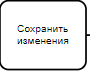
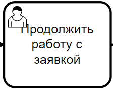
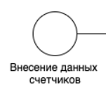
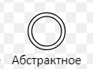
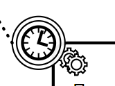
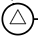
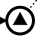
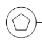
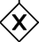
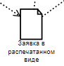

# 1. ВИДЫ ПРЕДСТАВЛЕНИЯ ГРАФИЧЕСКОЙ ИНФОРМАЦИИ
## 1.1.	Виды и назначение используемых диаграмм
*[Для описания бизнес-процессов рекомендуется использовать нотацию BPMN, для описания сущностей – ER-диаграмму. Однако для описания процессов также допустимо дополнительно применить EPC-нотацию, activity диаграмму или блок-схему.*  
*В данном разделе необходимо перечислить используемые типы диаграмм, их краткую характеристику, назначение.]*

# 1.2.	Обозначения элементов диаграмм
*[Кратко описать основные графические элементы ,  используемые в диаграммах, их обозначение и назначение по формату, приведенному в таблице ниже. Данная секция указывает, как надо читать используемые в документе диаграммы.]*  

Таблица 2 – Термины и сокращения
| № п/п | Элемент | Наименование, описание | Для чего используется |
|----|----|----|----|
| 1 |  | Функция | действие или набор действий, выполняемых над исходным объектом (документом, ТМЦ и прочим), чтобы получить заданный результат |
| 2 |  | Подпроцес | декомпозированный процесс, включённый в состав рассматриваемого процесса, который описан более подробно на своей диаграмме |
| 3 |  | Функция системы | функция, выполняемая системой | 
| 4 |  | Функция пользователя | функция, выполняемая пользователем | 
| 5 |  | Функция сообщения | функция, в процессе выполнения которой формируется и отправляется сообщение| 
| 6 |  | Событие | состояние, которое является существенным для целей управления бизнесом и влияет на дальнейшее развитие одного или более бизнес-процессов или контролирует его |
| 7 |  | Начальное событие | инициирует процес | 
| 8 |  | Конечное событие | завершает процесс | 
| 9 |  | Промежуточное событие | наступает в процессе выполнения процесса | 
| 10 |  | Событие сообщение (catching) | Отображает получение сообщения | 
| 11 |  | Событие сообщение (throwing) | Отображает отправку сообщения | 
| 12 |  | Событие по условию | Ожидает наступления определенного условия | 
| 13 |  | Событие по времени | для обозначения цикличных событий, интервалов времени или конкретных моментов времени | 
| 14 |  | Событие сигнала (catching) | обработка сигналов | 
| 15 |  | Событие сигнала (throwing) | генерация сигналов | 
| 16 |  | Копмлексное событие | обработка события из задоного множества |
| 17 |  | Эксклюзивный шлюз | используется для ветвления потока управления на несколько альтернативных потоков, когда выполнение процесса зависит от выполнения некоторого условия | 
| 18 |  | Параллельный шлюз | используется для обозначения слияния или ветвления потоков управления в рамках процесса |
| 19 |  | Объект данных | отображает данные, задействованные в процессе |
