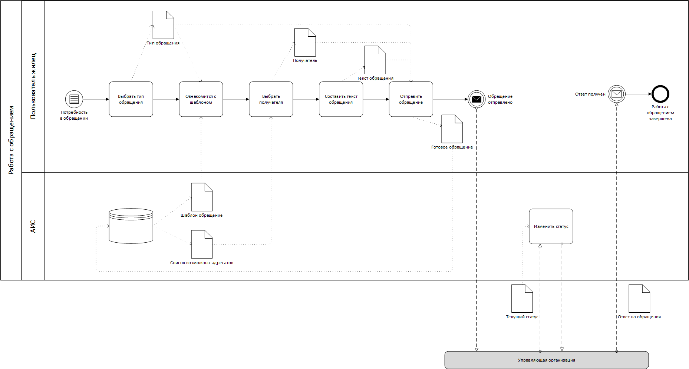
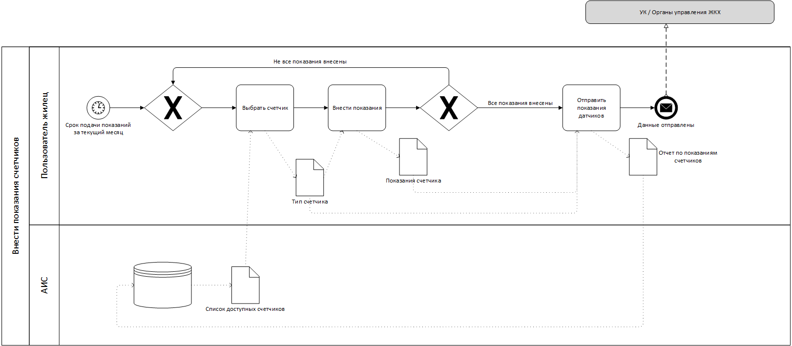
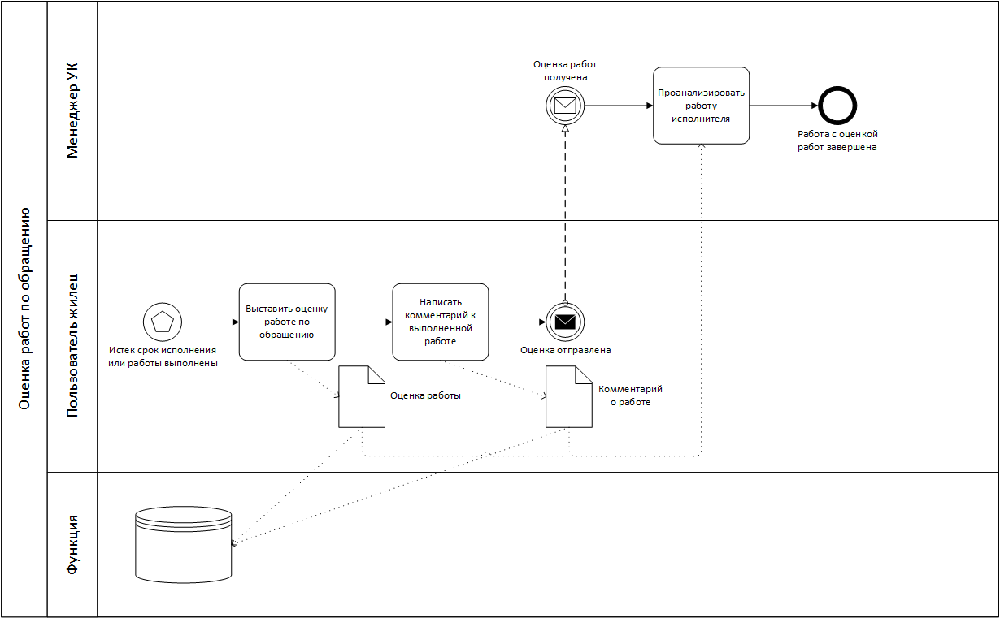

# 2.	ОПИСАНИЕ БИЗНЕС-ПРОЦЕССОВ

## 2.1.	"Составление обращения в ЛК Жильца"
### 2.1.1. Диаграмма бизнес-процесса 

Рис.1 - Диаграмма "Составление обращения в ЛК Жильца"

### 2.1.2.	Описание процесса "Составление обращения в ЛК Жильца"
Пользователь выбирает тип обращения и получателя обращения. Затем, опираясь на соотвесвующий шаблон, составляется текст обращения и отправляется в организацию. В процессе обработки обращения статус обращения в ЛК меняется. По завершению обработки обращения пользователю приходит ответ.

### 2.1.3. Описание функций бизнес-процесса "Составление обращения в ЛК Жильца" 

Таблица 1 – Описание функций процесса "Составление обращения в ЛК Жильца" 
| Наименование функции | "Выбрать тип обращения" |
|----|----|
| **Роли пользователей, участвующих в выполнении функции** | Зарегестрированный пользователь "Жилец" |
| **Входные данные функции** |  |
| **Описание действия** | Условие: пользователь зарегестрирован и находится в разделе обращений. Пользователь выбирает из списка типов обращения необходимый. Конечное событие: пользователь выбрал тип обращения и направляется в раздел выбранного типа обращения. |
| **Выходные данные функции** | Тип обращения |
___
___
___
Таблица 2 – Описание функций процесса "Составление обращения в ЛК Жильца"  
| Наименование функции | "Ознакомится с шаблоном" |
|----|----|
| **Роли пользователей, участвующих в выполнении функции** | Зарегестрированный пользователь "Жилец" |
| **Входные данные функции** | Тип обращения, Шаблон данного типа обращения |
| **Описание действия** | Условие: пользователь зарегестрирован и находится в разделе выбранного типа обращения, куда загружен шаблон. Пользователь ознакамливается с шаблоном соответсвующего типа сообщения. Конечное событие: пользователь ознакомился с шаблоном обращения. |
| **Выходные данные функции** |  |
___
___
___
Таблица 3 – Описание функций процесса "Составление обращения в ЛК Жильца"  
| Наименование функции | "Выбрать получателя" |
|----|----|
| **Роли пользователей, участвующих в выполнении функции** | Зарегестрированный пользователь "Жилец" |
| **Входные данные функции** | Список возможных адресатов |
| **Описание действия** | Условие: в раздел обращения подгружены возможные адресаты. Конечное событие: пользователь выбрал нужного получателя. |
| **Выходные данные функции** | Получатель |
___
___
___
Таблица 4 – Описание функций процесса "Составление обращения в ЛК Жильца"  
| Наименование функции | "Составить текст обращения" |
|----|----|
| **Роли пользователей, участвующих в выполнении функции** | Зарегестрированный пользователь "Жилец" |
| **Входные данные функции** | |
| **Описание действия** | Условие: в разделе обращения выбран получатель. Пользователь вводит текст обращения. Конечное событие: обращение составлено и сохранено в БД. |
| **Выходные данные функции** | Текст обращения |
___
___
___
Таблица 5 – Описание функций процесса "Составление обращения в ЛК Жильца"  
| Наименование функции | "Отправить обращение" |
|----|----|
| **Роли пользователей, участвующих в выполнении функции** | Зарегестрированный пользователь "Жилец" |
| **Входные данные функции** | Тип, получатель и текст обращения |
| **Описание действия** | Условие: пользователь зарегестрирован и находится в разделе выбранного типа обращения и заполнил все необходимые поля. Пользователь нажимает кнопку "ОТправить". Конечное событие: обращение отправлено. |
| **Выходные данные функции** |  |
___
___
___
Таблица 6 – Описание функций процесса "Составление обращения в ЛК Жильца"  
| Наименование функции | "Изменить статус" |
|----|----|
| **Роли пользователей, участвующих в выполнении функции** | АИС |
| **Входные данные функции** | Новый статус от модуля "УК" или модуля "РСО" |
| **Описание действия** | Модуль "УК" или модуль "РСО" присылают данные о новом статусе. Конечное событие: статус в разделе обращения изменился на текущий. |
| **Выходные данные функции** | Запрос текущего статуса |

## 2.2.	"Внесение показателей счетчиков"
### 2.2.1. Диаграмма бизнес-процесса  

Рис.1 - Диаграмма "Внесение показателей счетчиков"

### 2.2.2.	Описание процесса "Составление обращения в ЛК Жильца"
Пользователь выбирает счетчик и вносит его показания в форму. Повторяет так со всеми счетчиками. Далее данные отправляются в управляющее организации.

Таблица 7 – Описание функций процесса "Внесение показателей счетчиков"

| Наименование функции | "Выбрать счетчик" |
|----|----|
| **Роли пользователей, участвующих в выполнении функции** | Зарегестрированный пользователь "Жилец" |
| **Входные данные функции** | Список доступных счетчиков |
| **Описание действия** | Условие: пользователь зарегестрирован и находится в разделе внесения показателей счетчиков. Пользователь выбирает счетчик для внесения показанийю. Начальное событие: Подошел срок подачи показаний за текущий месяц. Конечное событие: счетчик для внесения данных выбран. |
| **Выходные данные функции** | Выбранный тип счетчиков |
___
___
___
Таблица 8 – Описание функций процесса "Внесение показателей счетчиков"

| Наименование функции | "Внести показания" |
|----|----|
| **Роли пользователей, участвующих в выполнении функции** | Зарегестрированный пользователь "Жилец" |
| **Входные данные функции** | Выбранный тип счетчиков |
| **Описание действия** | Пользователь вносит данные счетчиков. Конечное событие: показания датчиков внесены в форму. |
| **Выходные данные функции** | Показания счетчиков |
___
___
___
Таблица 9 – Описание функций процесса "Внесение показателей счетчиков"

| Наименование функции | "Отправить показания счетчиков" |
|----|----|
| **Роли пользователей, участвующих в выполнении функции** | Зарегестрированный пользователь "Жилец" |
| **Входные данные функции** | Выбранный тип счетчиков, Показания счетчиков |
| **Описание действия** | Пользователь нажимает на кнопку "Отправить показания счетчиков". Конечное событие: отчет по показаниям счетчиков отправлен в ресурсоснабжающую организацию и сохранен в БД. |
| **Выходные данные функции** | Отчет по показаниям 
счетчиков |

## 2.3.	"Выставление оценки"
### 2.3.1. Диаграмма бизнес-процесса  

Рис.1 - Диаграмма "Внесение показателей счетчиков"

### 2.3.2.	Описание процесса "Выставление оценки"
После наступления срока выполнения работ по заявки или, когда работы выполнены, полльзователь "Жилец" выставляет оценку работе организации и пишет комментарий. Сформированная оценка отправляется в управляющую организацию для анализа работы исполнителей.

Таблица 10 – Описание функций процесса "Внесение показателей счетчиков"

| Наименование функции | Выставить оценку работе по обращению |
|----|----|
| **Роли пользователей, участвующих в выполнении функции** | Зарегестрированный пользователь "Жилец" |
| **Входные данные функции** | .... |
| **Описание действия** | Условие: пользователь находится в разделе обращения со статусом "Обработано" и прошел срок выполнения работ или работы выполнены. Конечное событие: оценка выставлена. |
| **Выходные данные функции** | Оценка работы по обращению |
___
___
___
Таблица 11 – Описание функций процесса "Внесение показателей счетчиков"

| Наименование функции | "Написать комментарий к выполненной работе" |
|----|----|
| **Роли пользователей, участвующих в выполнении функции** | Зарегестрированный пользователь "Жилец" |
| **Входные данные функции** | .... |
| **Описание действия** | Пользователь вводит текст комментария в форму. Начальное событие: оценка выставлена. Конечное событие: оценка и комментарий сохранен в БД и отправлен в управляющую организацию. |
| **Выходные данные функции** | Комментарий о работе по обращению. |
___
___
___
Таблица 12 – Описание функций процесса "Внесение показателей счетчиков"

| Наименование функции | "Проанализировать работу исполнителя" |
|----|----|
| **Роли пользователей, участвующих в выполнении функции** | Зарегестрированный пользователь "менеджер УК" |
| **Входные данные функции** | Полная оценка работ (оценка и комментарий) |
| **Описание действия** | Менеджер получает доступ к оценке и комментарию по работе по обращению для анализа работы исполнителя. Начальное событие: Оценка работ получена.|
| **Выходные данные функции** | .... |

## 2.5.	Редактирование заявки от гражданина
### 2.5.1. Диаграмма бизнес-процесса

Рисунок 1 – Диаграмма "Редактирование заявки от гражданина"

### 2.5.2.	Описание процесса "Редактирование заявки от гражданина"

Когда у представителя РКО возникает потребность обновить статус заявки от гражданина, он/она выполняет вход в систему, переходит в раздел "Заявки", выбирает нужную заявку и переходит к ее более подробному описанию. Затем представитель РКО изменяет статус или другой необходимый параметр и сохраняет изменения. В этот момент изменения сохраняются/обновляются в базе данных. И в конце, гражданину, отправившему заявку, автоматически отправляется письмо/уведомление о том, что данные по его заявки изменены.

### 2.5.3.	Описание функций бизнес-процесса "Редактирование заявки от гражданина"

Таблица 1 – Описание функций процесса "Редактирование заявки от гражданина" 

| Наименование функции | Вход в систему |
|----|----|
| **Роли пользователей, участвующих в выполнении функции** | Представитель РКО |
| **Входные данные функции** | - |
| **Описание действия** | Представитель РКО выполняет вход в систему |
| **Выходные данные функции** | - |

| Наименование функции | Переход в раздел "Заявки" |
|----|----|
| **Роли пользователей, участвующих в выполнении функции** | Представитель РКО; Система |
| **Входные данные функции** | Список заявок |
| **Описание действия** | Представитель РКО переходит в раздел "Заявки", получая список заявок из БД |
| **Выходные данные функции** | - |

| Наименование функции | Открытие подробностей заявки |
|----|----|
| **Роли пользователей, участвующих в выполнении функции** | Представитель РКО; Система |
| **Входные данные функции** | Подробная информации о заявке |
| **Описание действия** | Представитель РКО открывает более подробное описание заявки, получая информацию о заявке из БД |
| **Выходные данные функции** | - |

| Наименование функции | Изменение статуса заявки |
|----|----|
| **Роли пользователей, участвующих в выполнении функции** | Представитель РКО |
| **Входные данные функции** | - |
| **Описание действия** | Представитель РКО изменятет статус заявки или другую необходимую информацию |
| **Выходные данные функции** | - |

| Наименование функции | Сохранение изменений |
|----|----|
| **Роли пользователей, участвующих в выполнении функции** | Представитель РКО; Система |
| **Входные данные функции** | - |
| **Описание действия** | Представитель РКО нажимает на кнопку "Сохранить"; Система сохраняет/обновляет статус заявки |
| **Выходные данные функции** | Новый статус заявки |

| Наименование функции | Отправка жильцу уведомления об изменении статуса заявки |
|----|----|
| **Роли пользователей, участвующих в выполнении функции** | Система |
| **Входные данные функции** | - |
| **Описание действия** | Система отправляет гражданину, отправившему заявку, увебомление об изменении статуса заявки |
| **Выходные данные функции** | - |

## 2.6.	Редактирование обращения от гражданина
### 2.6.1. Диаграмма бизнес-процесса

Рисунок 1 – Диаграмма "Редактирование обращения от гражданина"

### 2.6.2.	Описание процесса "Редактирование обращения от гражданина"

Когда у представителя РКО возникает потребность обновить статус обращения от гражданина, он/она выполняет вход в систему, переходит в раздел "Работа с обращениями", выбирает нужное обращение и переходит к ее более подробному описанию. Затем представитель РКО изменяет статус или другой необходимый параметр и сохраняет изменения. В этот момент изменения сохраняются/обновляются в базе данных. И в конце, гражданину, отправившему обращение, автоматически отправляется письмо/уведомление о том, что данные по его обращения изменены.

### 2.6.3. Описание функций бизнес-процесса "Редактирование обращения от гражданина"

Таблица 2 – Описание функций процесса "Редактирование обращения от гражданина" 

| Наименование функции | Вход в систему |
|----|----|
| **Роли пользователей, участвующих в выполнении функции** | Представитель РКО |
| **Входные данные функции** | - |
| **Описание действия** | Представитель РКО выполняет вход в систему |
| **Выходные данные функции** | - |

| Наименование функции | Переход в раздел "Работа с обращениями" |
|----|----|
| **Роли пользователей, участвующих в выполнении функции** | Представитель РКО; Система |
| **Входные данные функции** | Список заявок |
| **Описание действия** | Представитель РКО переходит в раздел "Работа с обращениями", получая список обращений из БД |
| **Выходные данные функции** | - |

| Наименование функции | Открытие подробностей обращения |
|----|----|
| **Роли пользователей, участвующих в выполнении функции** | Представитель РКО; Система |
| **Входные данные функции** | Подробная информации об обращении |
| **Описание действия** | Представитель РКО открывает более подробное описание обращения, получая информацию об обращении из БД |
| **Выходные данные функции** | - |

| Наименование функции | Изменение статуса обращения |
|----|----|
| **Роли пользователей, участвующих в выполнении функции** | Представитель РКО |
| **Входные данные функции** | - |
| **Описание действия** | Представитель РКО изменятет статус обращения или другую необходимую информацию |
| **Выходные данные функции** | - |

| Наименование функции | Сохранение изменений |
|----|----|
| **Роли пользователей, участвующих в выполнении функции** | Представитель РКО; Система |
| **Входные данные функции** | - |
| **Описание действия** | Представитель РКО нажимает на кнопку "Сохранить"; Система сохраняет/обновляет статус обращения |
| **Выходные данные функции** | Новый статус обращения |

| Наименование функции | Отправка жильцу уведомления об изменении статуса обращения |
|----|----|
| **Роли пользователей, участвующих в выполнении функции** | Система |
| **Входные данные функции** | - |
| **Описание действия** | Система отправляет гражданину, отправившему обращение, увебомление об изменении статуса обращения |
| **Выходные данные функции** | - |

## 2.7.	Расчет нового счета
### 2.7.1. Диаграмма бизнес-процесса 

Рисунок 1 – Диаграмма "Расчет нового счета"

### 2.7.2.	Описание процесса "Расчет нового счета"

Когда жилец вносит показатели счетчиков, система считывает их, берет тарифы за услуги из базы данных и расчитывает итоговою стоиммость за услуги. Затем система сохраняет рассчитаную стоимость за услуги в БД. И в конце, представителю РКО отображается список счетов за услуги, выставленные жильцам.

### 2.7.3.	Описание функций бизнес-процесса "Расчет нового счета"

Таблица 3 – Описание функций процесса 3  
| Наименование функции | Подпроцесс 1 "Внести показатели счетчиков" |
|----|----|
| **Роли пользователей, участвующих в выполнении функции** | Жилец; Система |
| **Входные данные функции** | - |
| **Описание действия** | Жилец вводит показатели счетчиков и система сохраняет их |
| **Выходные данные функции** | Показатели счетчиков |

| Наименование функции | Расчет итоговой стоимости за услугу |
|----|----|
| **Роли пользователей, участвующих в выполнении функции** | Система |
| **Входные данные функции** | Тарифы за услуги |
| **Описание действия** | Система берет из БД показатели счетчиков жильца и тарифы, рассчитывает стоимость за услуги и сохраняет ее в БД |
| **Выходные данные функции** | Итоговая стоимость за услуги |

| Наименование функции | Отображение записей расчета |
|----|----|
| **Роли пользователей, участвующих в выполнении функции** | Представитель РСО; Система |
| **Входные данные функции** | Список итоговых стоимостей за услуги |
| **Описание действия** | Система отображает представителю РКО список счетов за услуги, выставленные жильцам |
| **Выходные данные функции** | - |

## 2.8.	Добавление прибора учета в систему
### 2.8.1. Диаграмма бизнес-процесса

Рисунок 1 – Диаграмма "Добавление прибора учета в систему"

### 2.8.2.	Описание процесса "Добавление прибора учета в систему"

Представитель РКО заходит в личный кабинет и вносит данные о новом счетчике и затем система сохраняет их.

### 2.8.3.	Описание функций бизнес-процесса "Добавление прибора учета в систему"

Таблица 3 – Описание функций процесса 4  
| Наименование функции | Вход в систему |
|----|----|
| **Роли пользователей, участвующих в выполнении функции** | Представитель РКО |
| **Входные данные функции** | - |
| **Описание действия** | Представитель РКО выполняет вход в систему |
| **Выходные данные функции** | - |

| Наименование функции | Переход в раздел "Приборы учета" |
|----|----|
| **Роли пользователей, участвующих в выполнении функции** | Представитель РКО; Система |
| **Входные данные функции** | - |
| **Описание действия** | Представитель РКО переходит в раздел "Приборы учета". Система отображает список приборов учета, получая его из БД |
| **Выходные данные функции** | - |

| Наименование функции | Внесение данных о приборе учета |
|----|----|
| **Роли пользователей, участвующих в выполнении функции** | Представитель РКО |
| **Входные данные функции** | - |
| **Описание действия** | Представитель РКО вносит данные о приборе учета |
| **Выходные данные функции** | Данные о приборе учета |

| Наименование функции | Сохранение изменений |
|----|----|
| **Роли пользователей, участвующих в выполнении функции** | Представитель РКО; Система |
| **Входные данные функции** | - |
| **Описание действия** | Представитель РКО нажимает на кнопку "Сохранить"; Система добавляет информацию о приборе учета в БД |
| **Выходные данные функции** | Данные о приборе учета |

## 2.9.	Создание заявки в Базе заявок
### 2.9.1. Диаграмма бизнес-процесса 

Рис. - Диаграмма "Получение и обработка заявков из ЛК Жильца"

### 2.9.2.	Описание процесса "Создание заявки в Базе заявок"

Таблица 1 – Описание функций процесса "Создание заявки в Базе данных\
 **Стартовое событие: Жилец подает заявку в личном кабинете**\
 В ЛК-УК, автометически: 
 - Заявке присваеватся номер
 - Присваевается первоначальный статус "В обработке" 
 - Номер и статус отправляются в ЛК Жильца
 - Заполнить тело заявки из обращения жильца
 - Заполняются поля с данными Жильца и Адресом
 - Присваевается тип заявки в сответствии с выборанным в ЛК Жильца при подаче
 - В соответствии с типом заявки присваеваются "Важность" и Крайний срок выполнения
 - Если заявка важная, то в сводной таблице заявок строчка данной заявки выделяется красным цветом (FE0000) с прозрачностью (20%)
 - Заявка создется в базе данных
 - Заявка создана (сигнал всем связаным процессам)

 В итоге получается полностью созданная заявка в БД

### 2.9.3.	Описание функций бизнес-процесса "Создание заявки в Базе заявок"

| 1 Наименование функции | Присвоить номер заявке |
|----|----|
| **Роли пользователей, участвующих в выполнении функции** | АИС |
| **Входные данные функции** | заявка из ЛК Жильца |
| **Описание действия** | генерируется уникальный номер заявки и присвается в БД |
| **Выходные данные функции** | Номер заявки |

| 2 Наименование функции | Присвоить статус заявке "В обработке" |
|----|----|
| **Роли пользователей, участвующих в выполнении функции** | АИС |
| **Входные данные функции** | заявка из ЛК Жильца  |
| **Описание действия** | Присвается изначальный статус в БД |
| **Выходные данные функции** | Статус заявки |

| 3 Наименование функции | Отправить сообщение в ЛК Жильца |
|----|----|
| **Роли пользователей, участвующих в выполнении функции** | АИС |
| **Входные данные функции** | Номер и статус заявки |
| **Описание действия** | Отправить сообщение в ЛК Жильца  |
| **Выходные данные функции** | Номер и статус заявки |

| 4 Наименование функции | Заполнить тело заявки |
|----|----|
| **Роли пользователей, участвующих в выполнении функции** | АИС |
| **Входные данные функции** | Основной текст из обращения жильца |
| **Описание действия** | Заполнить "Тело" заявки в БД |
| **Выходные данные функции** | Основной текст в "Теле" заявки в БД |

| 5 Наименование функции | Присвоить тип заявки |
|----|----|
| **Роли пользователей, участвующих в выполнении функции** | АИС |
| **Входные данные функции** | Тип заявки из обращения ЛК Жильца |
| **Описание действия** | Присвоить тип заявки в БД |
| **Выходные данные функции** | Тип заявки в БД |

| 6 Наименование функции | Заполнить данные о жильце и объекте |
|----|----|
| **Роли пользователей, участвующих в выполнении функции** | АИС |
| **Входные данные функции** | идентификаторы Жильца и Объекта |
| **Описание действия** | Взять данные из профилей Жильца и Объекта и записать их в заявку |
| **Выходные данные функции** | Контактное лицо: ФИО, Тел., Адрес  |

| 7 Наименование функции | Присвоить "Важность" заявки |
|----|----|
| **Роли пользователей, участвующих в выполнении функции** | АИС |
| **Входные данные функции** | Тип заявки |
| **Описание действия** | Присвоить "Важность" в соответсвии с типом заявки |
| **Выходные данные функции** | Важная, не важная |

| 8 Наименование функции | Присвоить крайни срок выполнения |
|----|----|
| **Роли пользователей, участвующих в выполнении функции** | АИС |
| **Входные данные функции** | Тип заявки |
| **Описание действия** | Присвоить крайнюю дату выполнения заявки |
| **Выходные данные функции** | Дата |

| 9 Наименование функции | Пометить заявки в сводной таблице заявок |
|----|----|
| **Роли пользователей, участвующих в выполнении функции** | АИС |
| **Входные данные функции** | Важная заявка |
| **Описание действия** | выделя |
| **Выходные данные функции** | выделение строчки в сводной таблице заявок красным цветом (FE0000) с прозрачностью (20%) |

## 2.10. Обработка заявки
### 2.10.1. Диаграмма бизнес-процесса

### 2.10.2.	Описание процесса "Обработка заявки"
После создания заявки в АИС приходит оповещение о новой заявке в модуле уведомлений и она появляетс в сводной таблице заявок
Далее происходит обработка заявки сотрудником УК (Диспетчер, Оператор, Менеджер):
 - если заявка платная то она сразу перенаправляется Менеджеру 
 - подгатавливается счет
 - если Жилец отказался от оплаты счета, то закрыть заявку со статусом "Отменена" и отправить статус заявки в ЛК Жильца
 - Если в заявке нет платных услуг или счет за платные услуги принят и оплачен Жильцом, то продолжить работу с заявкой Оператору/Диспетчеру 
 - При необходимости добавить/дополнить комментарий к заявке
 - Назначить исполнителя
 - Присваевоить текущий статус заявки
 - Сохранить изменения
 - Отправить сообщение в ЛК Жильца с Номером заявки и Статусом
 - Распечатать заявку и передать исполнителю

### 2.10.3.	Описание функций бизнес-процесса "Обработка заявки"

Таблица 2 – Описание функций процесса 2

| 1 Наименование функции | Оплата услуг |
|----|----|
| **Роли пользователей, участвующих в выполнении функции** | Менеджер |
| **Входные данные функции** | Платная заявка |
| **Описание действия** | Подпроцесс |
| **Выходные данные функции** | Статус счета |

| 2 Наименование функции | Подтверждение оплаты счета |
|----|----|
| **Роли пользователей, участвующих в выполнении функции** | АИС |
| **Входные данные функции** | Счет оплачен |
| **Описание действия** | Прислать подтвеждение об оплате счета |
| **Выходные данные функции** | Счет олпачен |

| 3 Наименование функции | Добавить комментарий к заявке |
|----|----|
| **Роли пользователей, участвующих в выполнении функции** | Менеджер, Оператор, Диспетчер |
| **Входные данные функции** | Созданная заявка |
| **Описание действия** | Вписать комментарий в поле ввода |
| **Выходные данные функции** | Текст комментария |

| 4 Наименование функции | Назначить исполнителя |
|----|----|
| **Роли пользователей, участвующих в выполнении функции** | Оператор или Диспетчер |
| **Входные данные функции** | Данные по заявке заполнены |
| **Описание действия** | Выбрать исполнителя из выпадающего списка |
| **Выходные данные функции** | Данные исполниеля: ФИО, Контактный телефон, Должность |

| 5 Наименование функции | Сохранить изменения |
|----|----|
| **Роли пользователей, участвующих в выполнении функции** | Оператор или Диспетчер или Менеджер |
| **Входные данные функции** | Заполнены все необходимые данные по заявке |
| **Описание действия** | Сохранить все данные заявки в БД |
| **Выходные данные функции** | Все данные по заявке |

| 6 Наименование функции | Присвоить статус заявке |
|----|----|
| **Роли пользователей, участвующих в выполнении функции** | Менеджер или Диспетчер или Оператор |
| **Входные данные функции** | Изменение статуса заявки |
| **Описание действия** | Изменить статус заявки в выпадающем списке |
| **Выходные данные функции** | Статус заявки |

| 7 Наименование функции | Распечатать заявку |
|----|----|
| **Роли пользователей, участвующих в выполнении функции** | Диспетчер или Оператор |
| **Входные данные функции** | Заполненная заявка |
| **Описание действия** | Распечатать заявку |
| **Выходные данные функции** | Заявка на бумажном носителе |

| 8 Наименование функции | Отправить сообщение |
|----|----|
| **Роли пользователей, участвующих в выполнении функции** | АИС |
| **Входные данные функции** | Статус заявки, Номер заявки |
| **Описание действия** | Отправить сообщение с Номером и Статусом заявки в ЛК Жильца |
| **Выходные данные функции** | Номер и Статус заявки |

## 2.11. Выставление счета за разовые платные услуги
### 2.11.1. Диаграмма бизнес-процесса  "Выставление счета за разовые платные услуги"

### 2.11.2.	Описание процесса "Выставление счета за разовые платные услуги"
После создания заявки с платными услугами в АИС она перенаправляется менеджеру для выставления счета. Менеджер в АИС рассчитывает объем услуг и матриалов, выставляет крайний срок оплаты автоматически генерируется счет по форме 1С, менеджер выставляет счет в АИС. Далее счет заносится в 1С и отправляется в ЛК Жильца для оплаты.
Если жилец не оплачивает счет или отменяет его, то на выходе в АИС появится событие "Счет отменен". Если жилец оплачивает счет, то в АИС появится событие "Счет оплачен". Все оконечные собтия отправятся в модуль "заявок".
 
### 2.11.3.	Описание функций бизнес-процесса "Выставление счета за разовые платные услуги"

Таблица 2 – Описание функций процесса "Выставление счета за разовые платные услуги"

| Наименование функции | Расчитать платные услуги |
|----|----|
| **Роли пользователей, участвующих в выполнении функции** | Менеджер |
| **Входные данные функции** | Услуги перечисленные в заявке |
| **Описание действия** | Рассчитать объем услуг средствами АИС, выставить срок оплаты |
| **Выходные данные функции** | Рассчет услуг и материалов |

| Наименование функции | Подготовить счет |
|----|----|
| **Роли пользователей, участвующих в выполнении функции** | АИС |
| **Входные данные функции** | Рассчет услуг и материалов |
| **Описание действия** | сгенерировать счет по форме 1С |
| **Выходные данные функции** | счет по форме 1С |

| Наименование функции | Выставить счет |
|----|----|
| **Роли пользователей, участвующих в выполнении функции** | Менеджер |
| **Входные данные функции** | счет по форме 1С |
| **Описание действия** | нажать на кнопку "выставить счет" |
| **Выходные данные функции** | счет по форме 1С |

| Наименование функции | Отправить счет в ЛК Жильца |
|----|----|
| **Роли пользователей, участвующих в выполнении функции** | АИС |
| **Входные данные функции** | счет по форме 1С |
| **Описание действия** | отправить счет в ЛК Жильца |
| **Выходные данные функции** | счет в ЛК Жильца |

| Наименование функции | Занести счет в АИС Бухгалтерии |
|----|----|
| **Роли пользователей, участвующих в выполнении функции** | АИС, АИС бухгалтерии |
| **Входные данные функции** | счет по форме 1С |
| **Описание действия** | Занести счет в АИС Бухгалтерии через API |
| **Выходные данные функции** | счет по форме 1С |

| Наименование функции | Подтвердить счет |
|----|----|
| **Роли пользователей, участвующих в выполнении функции** | АИС |
| **Входные данные функции** | счет оплачен в ЛК Жильца |
| **Описание действия** | Ожидаем подтверждения оплаты |
| **Выходные данные функции** | подтверждение счета |

| Наименование функции | Подтвердить оплату счета |
|----|----|
| **Роли пользователей, участвующих в выполнении функции** | АИС, АИС бухгалтерии |
| **Входные данные функции** | Статус счета из АИС бухгалтерии "Оплачен" |
| **Описание действия** | Ожидаем подтверждения оплаты от АИС бухгалтерии |
| **Выходные данные функции** | подтверждение оплаты счета |
